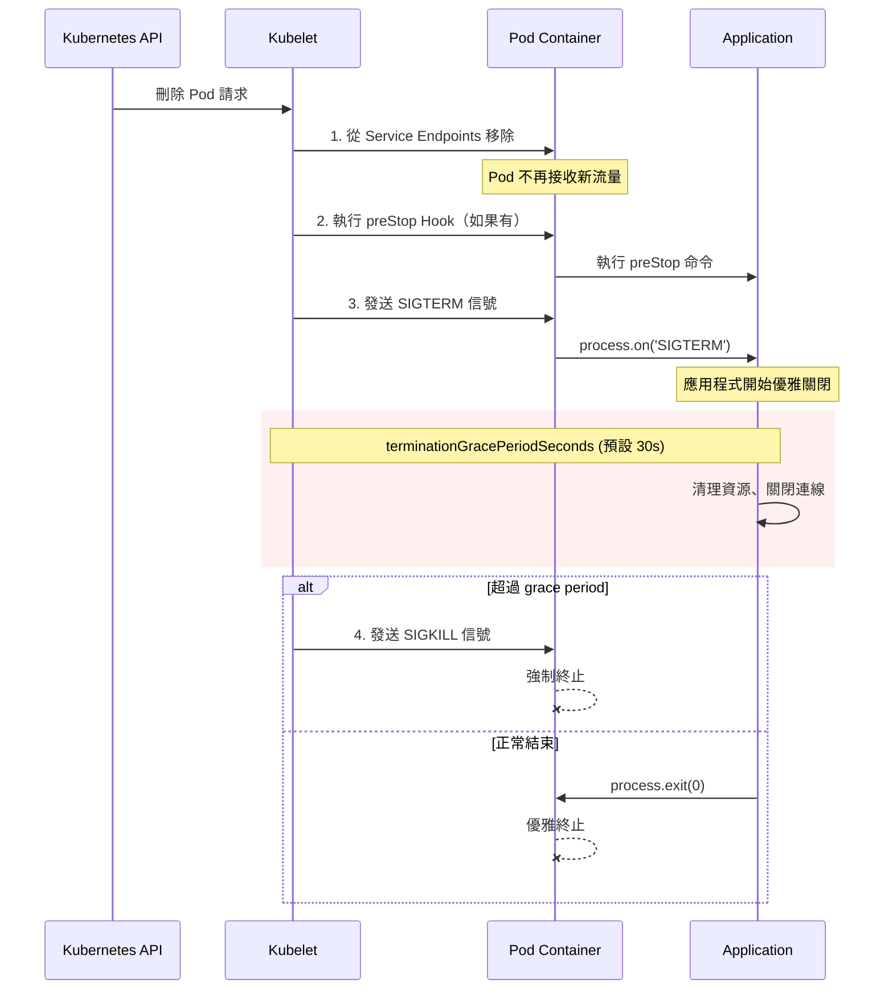
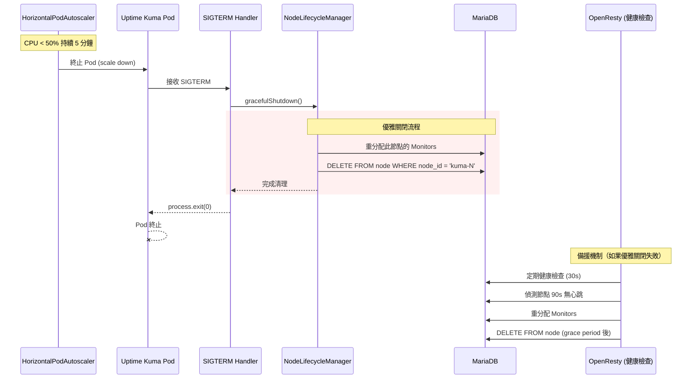

# K8s 縮容時自動移除離線節點計劃

## 📋 目標

當 K8s HorizontalPodAutoscaler (HPA) 縮容（減少 ReplicaSet/Pod）時，自動從資料庫**移除**離線節點記錄，而非僅標記為 `offline`。

---

## 📡 K8s 如何通知 Pod 刪除

### Pod 終止流程

當 K8s 決定刪除一個 Pod 時，會經過以下步驟：



### 信號說明

| 信號 | 說明 | 可捕獲 | 用途 |
|:---|:---|:---|:---|
| **SIGTERM** | 終止信號 | ✅ 是 | 通知應用程式優雅關閉 |
| **SIGKILL** | 強制終止 | ❌ 否 | grace period 超時後強制殺死 |
| **SIGINT** | 中斷信號 | ✅ 是 | Ctrl+C（本地開發用）|

### Node.js 捕獲 SIGTERM

```javascript
// 這就是我們的入口點
process.on('SIGTERM', async () => {
    console.log('Received SIGTERM, starting graceful shutdown...');
    
    // 1. 停止接收新請求
    // 2. 完成進行中的請求
    // 3. 清理資源（包括從 DB 移除節點）
    // 4. 關閉連線
    
    await gracefulShutdown();
    process.exit(0);
});
```

### K8s 觸發刪除的場景

| 場景 | 觸發方式 | SIGTERM 發送 |
|:---|:---|:---|
| **HPA 縮容** | 自動（CPU/Memory 低於閾值）| ✅ |
| **手動縮容** | `kubectl scale --replicas=N` | ✅ |
| **滾動更新** | `kubectl rollout restart` | ✅ |
| **節點維護** | `kubectl drain node` | ✅ |
| **強制刪除** | `kubectl delete pod --force` | ❌ 直接 SIGKILL |
| **OOM Kill** | 記憶體不足 | ❌ 直接 SIGKILL |

---

## 🛡️ 避免誤刪機制

### 誤刪風險場景

| 風險場景 | 說明 | 後果 |
|:---|:---|:---|
| **網路瞬斷** | 暫時性網路問題導致心跳失敗 | 節點被誤判離線並刪除 |
| **資料庫延遲** | DB 回應慢導致心跳超時 | 同上 |
| **Pod 重啟** | CrashLoopBackOff 頻繁重啟 | 節點記錄反覆建立刪除 |
| **時鐘偏移** | 節點間時間不同步 | 心跳判斷錯誤 |

### 防護機制設計

#### 1. 多重確認機制

```
┌─────────────────────────────────────────────────────────────┐
│                    節點刪除前置條件                          │
├─────────────────────────────────────────────────────────────┤
│ ✅ 條件 1: 收到 SIGTERM 信號（主動刪除）                     │
│    OR                                                       │
│ ✅ 條件 2: 心跳超時 >= 90 秒 AND 連續 3 次健康檢查失敗       │
│                                                             │
│ ✅ 條件 3: 節點狀態已標記為 'offline' >= 5 分鐘             │
│                                                             │
│ ✅ 條件 4: 節點不是 Primary（主節點永不自動刪除）           │
│                                                             │
│ ✅ 條件 5: 節點的 Monitors 已成功重分配                     │
└─────────────────────────────────────────────────────────────┘
```

#### 2. 刪除保護標記

```sql
-- 節點表新增保護欄位
ALTER TABLE node ADD COLUMN protected BOOLEAN DEFAULT FALSE;
ALTER TABLE node ADD COLUMN removal_blocked_until DATETIME NULL;

-- 範例：保護特定節點不被自動刪除
UPDATE node SET protected = TRUE WHERE node_id = 'kuma-0';

-- 範例：暫時阻止刪除（維護期間）
UPDATE node SET removal_blocked_until = DATE_ADD(NOW(), INTERVAL 1 HOUR) WHERE node_id = 'kuma-1';
```

#### 3. 實作程式碼

```javascript
// server/util/node-lifecycle.js

/**
 * 檢查節點是否可以安全刪除
 * @param {string} nodeId 
 * @returns {Promise<{canDelete: boolean, reason: string}>}
 */
async canSafelyDeleteNode(nodeId) {
    try {
        const node = await R.findOne("node", "node_id = ?", [nodeId]);
        
        if (!node) {
            return { canDelete: false, reason: "Node not found" };
        }

        // 檢查 1: 是否受保護
        if (node.protected) {
            return { canDelete: false, reason: "Node is protected" };
        }

        // 檢查 2: 是否在保護期內
        if (node.removal_blocked_until && new Date(node.removal_blocked_until) > new Date()) {
            return { canDelete: false, reason: `Removal blocked until ${node.removal_blocked_until}` };
        }

        // 檢查 3: 是否為主節點
        if (node.is_primary) {
            return { canDelete: false, reason: "Cannot delete primary node" };
        }

        // 檢查 4: 是否還有未重分配的 Monitors
        const monitorCount = await R.count("monitor", "node_id = ?", [nodeId]);
        if (monitorCount > 0) {
            return { canDelete: false, reason: `Node still has ${monitorCount} monitors` };
        }

        // 檢查 5: 確保不是最後一個節點
        const onlineNodes = await R.count("node", "status = ? AND node_id != ?", ["online", nodeId]);
        if (onlineNodes === 0) {
            return { canDelete: false, reason: "Cannot delete: no other online nodes" };
        }

        return { canDelete: true, reason: "OK" };
    } catch (err) {
        return { canDelete: false, reason: `Error: ${err.message}` };
    }
}

/**
 * 安全刪除節點
 */
async safeDeleteNode(nodeId) {
    const check = await this.canSafelyDeleteNode(nodeId);
    
    if (!check.canDelete) {
        log.warn("node-lifecycle", `Cannot delete node ${nodeId}: ${check.reason}`);
        // 改為標記 offline 而非刪除
        await R.exec("UPDATE node SET status = ? WHERE node_id = ?", ["offline", nodeId]);
        return false;
    }

    await R.exec("DELETE FROM node WHERE node_id = ?", [nodeId]);
    log.info("node-lifecycle", `Node ${nodeId} safely deleted`);
    return true;
}
```

#### 4. Lua 端防護（health_check.lua）

```lua
-- 檢查節點是否可以刪除
local function can_delete_node(node_id)
    local db, err = db_connect()
    if not db then
        return false, "DB connection failed"
    end

    local quoted_id = ngx.quote_sql_str(node_id)
    
    -- 檢查保護標記
    local check_sql = string.format([[
        SELECT 
            protected,
            is_primary,
            removal_blocked_until,
            (SELECT COUNT(*) FROM monitor WHERE node_id = %s) as monitor_count
        FROM node 
        WHERE node_id = %s
    ]], quoted_id, quoted_id)
    
    local res, qerr = db:query(check_sql)
    db:close()
    
    if not res or #res == 0 then
        return false, "Node not found"
    end
    
    local node = res[1]
    
    if node.protected == 1 then
        return false, "Node is protected"
    end
    
    if node.is_primary == 1 then
        return false, "Cannot delete primary node"
    end
    
    if node.removal_blocked_until and node.removal_blocked_until > ngx.now() then
        return false, "Removal temporarily blocked"
    end
    
    if tonumber(node.monitor_count) > 0 then
        return false, "Node still has monitors"
    end
    
    return true, "OK"
end

-- 安全刪除節點
local function safe_remove_node(node_id)
    local can_delete, reason = can_delete_node(node_id)
    
    if not can_delete then
        ngx.log(ngx.WARN, "[SAFE_DELETE] Cannot delete node ", node_id, ": ", reason)
        -- 改為標記 offline
        update_node_status(node_id, "offline")
        return false
    end
    
    return remove_node_from_db(node_id)
end
```

### 5. 刪除延遲（Grace Period）

```javascript
// 不立即刪除，而是標記為 "pending_removal"
async scheduleNodeRemoval(nodeId, delayMs = 300000) {  // 預設 5 分鐘
    const removalTime = new Date(Date.now() + delayMs).toISOString();
    
    await R.exec(
        "UPDATE node SET status = ?, scheduled_removal_at = ? WHERE node_id = ?",
        ["pending_removal", removalTime, nodeId]
    );
    
    log.info("node-lifecycle", `Node ${nodeId} scheduled for removal at ${removalTime}`);
}

// 清理任務中處理 pending_removal 節點
async processPendingRemovals() {
    const now = new Date().toISOString();
    
    const pendingNodes = await R.getAll(
        "SELECT node_id FROM node WHERE status = ? AND scheduled_removal_at <= ?",
        ["pending_removal", now]
    );
    
    for (const node of pendingNodes) {
        // 再次檢查是否可以安全刪除
        await this.safeDeleteNode(node.node_id);
    }
}
```

### 6. 操作日誌追蹤

```sql
-- 節點操作日誌表
CREATE TABLE node_operation_log (
    id INT AUTO_INCREMENT PRIMARY KEY,
    node_id VARCHAR(50) NOT NULL,
    operation ENUM('create', 'update', 'delete', 'offline', 'online', 'protected') NOT NULL,
    reason VARCHAR(255),
    operator VARCHAR(50),  -- 'system', 'hpa', 'manual', 'health_check'
    old_status VARCHAR(20),
    new_status VARCHAR(20),
    created_at DATETIME DEFAULT CURRENT_TIMESTAMP,
    INDEX idx_node_id (node_id),
    INDEX idx_created_at (created_at)
);

-- 記錄範例
INSERT INTO node_operation_log (node_id, operation, reason, operator, old_status, new_status)
VALUES ('kuma-2', 'delete', 'HPA scale down - SIGTERM received', 'system', 'online', NULL);
```

### 7. 告警機制

```javascript
// 當節點被刪除時發送告警
async notifyNodeRemoval(nodeId, reason) {
    const notification = {
        type: 'node_removed',
        nodeId: nodeId,
        reason: reason,
        timestamp: new Date().toISOString()
    };
    
    // 發送到 Slack/Discord/Email 等
    await this.sendNotification(notification);
    
    // 記錄到日誌
    log.warn("node-lifecycle", `[ALERT] Node ${nodeId} removed: ${reason}`);
}
```

---

## 🔄 現行行為 vs 新行為

| 項目 | 現行行為 | 新行為 |
|:---|:---|:---|
| **縮容時** | 節點標記為 `offline`，記錄保留 | 節點記錄直接從 DB 移除 |
| **Monitor 處理** | 重分配到其他健康節點 | 重分配到其他健康節點（不變） |
| **清理時機** | 1 小時後才刪除 `offline` 記錄 | 確認離線後立即刪除 |
| **節點恢復** | 可復用原有記錄 | 重新註冊（新建記錄） |

---

## 🏗️ 架構設計

### 縮容時的完整流程



### 兩種清理機制

| 機制 | 觸發時機 | 負責模組 | 優先級 |
|:---|:---|:---|:---|
| **主動清理** | Pod 收到 SIGTERM | `NodeLifecycleManager.gracefulShutdown()` | 優先 |
| **被動清理** | 心跳超時 (90s) | `health_check.lua` 或 `NodeLifecycleManager` | 備援 |

---

## 📝 實作計劃

### Phase 1: 優雅關閉（主動清理）

#### 1.1 修改 `server/util/node-lifecycle.js`

```javascript
// 新增常數
const GRACEFUL_SHUTDOWN_TIMEOUT = 10000; // 10 秒內完成清理

class NodeLifecycleManager {
    // ... 現有程式碼 ...

    /**
     * 優雅關閉 - Pod 終止前清理
     * @param {boolean} removeFromDb 是否從資料庫移除節點記錄
     * @returns {Promise<void>}
     */
    async gracefulShutdown(removeFromDb = true) {
        log.info("node-lifecycle", `Starting graceful shutdown for node: ${this.nodeId}`);
        
        // 停止心跳和清理定時器
        if (this.heartbeatTimer) {
            clearInterval(this.heartbeatTimer);
            this.heartbeatTimer = null;
        }
        if (this.cleanupTimer) {
            clearInterval(this.cleanupTimer);
            this.cleanupTimer = null;
        }

        if (!this.nodeId) {
            this.started = false;
            return;
        }

        try {
            // Step 1: 重新分配此節點的 monitors
            await this.reassignMonitors(this.nodeId);
            
            if (removeFromDb) {
                // Step 2: 從資料庫移除節點記錄
                await R.exec("DELETE FROM node WHERE node_id = ?", [this.nodeId]);
                log.info("node-lifecycle", `Node ${this.nodeId} removed from database`);
            } else {
                // 僅標記為 offline（向後兼容）
                await R.exec(
                    "UPDATE node SET status = ? WHERE node_id = ?",
                    ["offline", this.nodeId]
                );
                log.info("node-lifecycle", `Node ${this.nodeId} marked as offline`);
            }
        } catch (err) {
            log.error("node-lifecycle", `Graceful shutdown failed: ${err.message}`);
        }

        this.started = false;
    }

    /**
     * 原有 stop() 方法改為呼叫 gracefulShutdown
     */
    async stop() {
        // 使用環境變數控制是否移除記錄
        const removeFromDb = process.env.K8S_REMOVE_NODE_ON_SHUTDOWN === 'true';
        await this.gracefulShutdown(removeFromDb);
    }
}
```

#### 1.2 修改 `server/server.js` - SIGTERM 處理

```javascript
// 在 server.js 中新增 SIGTERM 處理
const nodeLifecycle = require("./util/node-lifecycle");

// 優雅關閉處理
async function handleShutdown(signal) {
    log.info("server", `Received ${signal}, starting graceful shutdown...`);
    
    try {
        // 設置超時保護
        const shutdownTimeout = setTimeout(() => {
            log.error("server", "Graceful shutdown timeout, forcing exit");
            process.exit(1);
        }, 15000); // 15 秒超時

        // 執行節點清理
        await nodeLifecycle.gracefulShutdown(true);
        
        // 關閉其他資源（如 Socket.io, Database 等）
        await server.close();
        
        clearTimeout(shutdownTimeout);
        log.info("server", "Graceful shutdown complete");
        process.exit(0);
    } catch (err) {
        log.error("server", `Shutdown error: ${err.message}`);
        process.exit(1);
    }
}

// 註冊信號處理器
process.on('SIGTERM', () => handleShutdown('SIGTERM'));
process.on('SIGINT', () => handleShutdown('SIGINT'));
```

---

### Phase 2: 被動清理（備援機制）

#### 2.1 修改 `server/util/node-lifecycle.js` - 縮短清理時間

```javascript
// 修改常數
const STALE_NODE_THRESHOLD = 300000;  // 5 分鐘後清理離線節點記錄（原本 1 小時）

// 可透過環境變數配置
const getStaleThreshold = () => {
    const envValue = process.env.NODE_STALE_THRESHOLD_MS;
    return envValue ? parseInt(envValue) : STALE_NODE_THRESHOLD;
};
```

#### 2.2 修改 `lua/health_check.lua` - 新增節點移除功能

```lua
-- 新增：從資料庫移除節點
local function remove_node_from_db(node_id)
    local db, err = db_connect()
    if not db then
        ngx.log(ngx.ERR, "Failed to connect DB for node removal: ", err)
        return false, err
    end

    -- 先重新分配 monitors（確保不會遺失）
    local redistribute_ok = redistribute_monitors_from_node(node_id)
    if not redistribute_ok then
        ngx.log(ngx.WARN, "Monitor redistribution failed for node: ", node_id)
    end

    -- 刪除節點記錄
    local quoted_id = ngx.quote_sql_str(node_id)
    local delete_sql = string.format("DELETE FROM node WHERE node_id = %s", quoted_id)
    local res, qerr = db:query(delete_sql)
    db:close()

    if res then
        ngx.log(ngx.INFO, "[NODE_REMOVAL] Node ", node_id, " removed from database")
        return true
    else
        ngx.log(ngx.ERR, "Failed to remove node ", node_id, ": ", qerr)
        return false, qerr
    end
end

-- 修改：清理過期離線節點
local function cleanup_stale_offline_nodes()
    local db, err = db_connect()
    if not db then
        return
    end

    -- 查找離線超過 5 分鐘的節點
    local stale_threshold = config.node_cleanup.stale_threshold or 300  -- 預設 5 分鐘
    local sql = string.format([[
        SELECT node_id FROM node 
        WHERE status = 'offline' 
        AND last_seen < DATE_SUB(NOW(), INTERVAL %d SECOND)
    ]], stale_threshold)

    local stale_nodes, qerr = db:query(sql)
    db:close()

    if not stale_nodes or #stale_nodes == 0 then
        return
    end

    for _, node in ipairs(stale_nodes) do
        ngx.log(ngx.INFO, "[CLEANUP] Removing stale offline node: ", node.node_id)
        remove_node_from_db(node.node_id)
    end
end
```

---

### Phase 3: K8s 配置優化

#### 3.1 Pod 配置 - 優雅終止

```yaml
# k8s/uptime-kuma/deployment.yaml 或 statefulset.yaml
spec:
  template:
    spec:
      terminationGracePeriodSeconds: 30  # 給予足夠時間清理
      containers:
        - name: uptime-kuma
          lifecycle:
            preStop:
              exec:
                command: ["/bin/sh", "-c", "sleep 5"]  # 等待流量排空
          env:
            - name: K8S_REMOVE_NODE_ON_SHUTDOWN
              value: "true"
            - name: NODE_STALE_THRESHOLD_MS
              value: "300000"  # 5 分鐘
```

#### 3.2 HPA 配置 - 縮容行為

```yaml
# k8s/uptime-kuma/hpa.yaml
apiVersion: autoscaling/v2
kind: HorizontalPodAutoscaler
metadata:
  name: uptime-kuma-hpa
spec:
  # ... 其他配置 ...
  behavior:
    scaleDown:
      stabilizationWindowSeconds: 300  # 5 分鐘穩定期
      policies:
        - type: Pods
          value: 1              # 每次最多縮減 1 個 Pod
          periodSeconds: 60     # 每 60 秒最多執行一次
```

---

## 📊 資料庫變更

### 新增欄位

```sql
-- 防護機制相關欄位
ALTER TABLE node ADD COLUMN protected BOOLEAN DEFAULT FALSE;
ALTER TABLE node ADD COLUMN removal_blocked_until DATETIME NULL;
ALTER TABLE node ADD COLUMN removal_mode ENUM('graceful', 'force', 'retain') DEFAULT 'graceful';
ALTER TABLE node ADD COLUMN scheduled_removal_at DATETIME NULL;
```

### 遷移腳本

```javascript
// db/knex_migrations/2026-01-03-0000-add-node-protection-fields.js
exports.up = async function (knex) {
    await knex.schema.alterTable("node", function (table) {
        // 防護標記：設為 true 的節點永不自動刪除
        table.boolean("protected").defaultTo(false);
        
        // 暫時阻止刪除：在此時間之前不會被刪除
        table.datetime("removal_blocked_until").nullable();
        
        // 刪除模式
        table.enum("removal_mode", ["graceful", "force", "retain"]).defaultTo("graceful");
        
        // 排程刪除時間
        table.datetime("scheduled_removal_at").nullable();
    });

    // 建立節點操作日誌表
    const hasLogTable = await knex.schema.hasTable("node_operation_log");
    if (!hasLogTable) {
        await knex.schema.createTable("node_operation_log", function (table) {
            table.increments("id");
            table.string("node_id", 50).notNullable();
            table.enum("operation", ["create", "update", "delete", "offline", "online", "protected"]).notNullable();
            table.string("reason", 255).nullable();
            table.string("operator", 50).defaultTo("system");  // 'system', 'hpa', 'manual', 'health_check'
            table.string("old_status", 20).nullable();
            table.string("new_status", 20).nullable();
            table.timestamp("created_at").defaultTo(knex.fn.now());
            table.index("node_id", "idx_log_node_id");
            table.index("created_at", "idx_log_created_at");
        });
    }
};

exports.down = async function (knex) {
    await knex.schema.alterTable("node", function (table) {
        table.dropColumn("protected");
        table.dropColumn("removal_blocked_until");
        table.dropColumn("removal_mode");
        table.dropColumn("scheduled_removal_at");
    });
    await knex.schema.dropTableIfExists("node_operation_log");
};
```

---

## 🔧 環境變數配置

| 環境變數 | 預設值 | 說明 |
|:---|:---|:---|
| `K8S_REMOVE_NODE_ON_SHUTDOWN` | `false` | 關閉時是否從 DB 移除節點 |
| `NODE_STALE_THRESHOLD_MS` | `300000` | 離線多久後清理（毫秒）|
| `NODE_OFFLINE_THRESHOLD_MS` | `90000` | 無心跳多久視為離線（毫秒）|
| `GRACEFUL_SHUTDOWN_TIMEOUT` | `10000` | 優雅關閉超時（毫秒）|
| `NODE_REMOVAL_GRACE_PERIOD_MS` | `300000` | 刪除前等待時間（毫秒）|
| `PROTECT_PRIMARY_NODE` | `true` | 是否保護主節點不被刪除 |

---

## 🧪 測試計劃

### 測試案例

| # | 測試項目 | 預期結果 |
|:---|:---|:---|
| 1 | 手動 `kubectl scale --replicas=2` | 被移除的 Pod 節點記錄從 DB 刪除 |
| 2 | HPA 自動縮容 | 同上 |
| 3 | `kubectl delete pod` 強制刪除 | 備援機制在 5 分鐘後清理 |
| 4 | Monitor 重分配正確性 | 所有 monitors 被正確分配到存活節點 |
| 5 | 節點重新擴容 | 新節點正常註冊，不衝突 |
| 6 | **保護節點測試** | `protected=true` 的節點不會被刪除 |
| 7 | **主節點保護** | `is_primary=true` 的節點不會被刪除 |
| 8 | **暫時阻止刪除** | `removal_blocked_until` 期間內不會被刪除 |
| 9 | **網路瞬斷恢復** | 心跳恢復後取消 pending_removal |
| 10 | **操作日誌記錄** | 所有刪除操作都有日誌 |

### 測試腳本

```bash
#!/bin/bash
# test-node-removal.sh

echo "=== 測試 K8s 縮容節點移除 ==="

# 記錄當前節點數
echo "1. 當前節點狀態："
kubectl exec -n uptime-kuma uptime-kuma-0 -- curl -s http://localhost:3001/api/v1/nodes | jq

# 縮容
echo "2. 執行縮容 (3 -> 2)："
kubectl scale statefulset uptime-kuma -n uptime-kuma --replicas=2

# 等待
echo "3. 等待 30 秒..."
sleep 30

# 檢查結果
echo "4. 縮容後節點狀態："
kubectl exec -n uptime-kuma uptime-kuma-0 -- curl -s http://localhost:3001/api/v1/nodes | jq

# 檢查 monitors 是否正確重分配
echo "5. Monitor 分配狀態："
kubectl exec -n uptime-kuma uptime-kuma-0 -- curl -s http://localhost:8084/lb/capacity

# 檢查操作日誌
echo "6. 節點操作日誌："
kubectl exec -n uptime-kuma uptime-kuma-0 -- curl -s http://localhost:3001/api/v1/node-logs | jq
```

### 防護機制測試

```bash
#!/bin/bash
# test-node-protection.sh

echo "=== 測試節點保護機制 ==="

# 1. 設置保護節點
echo "1. 保護 kuma-0 節點："
kubectl exec -n uptime-kuma uptime-kuma-0 -- curl -X POST http://localhost:3001/api/v1/nodes/kuma-0/protect

# 2. 嘗試縮容到 0（應該失敗保護主節點）
echo "2. 嘗試縮容..."
kubectl scale statefulset uptime-kuma -n uptime-kuma --replicas=0

# 3. 驗證保護節點仍存在
echo "3. 驗證保護節點："
kubectl exec -n uptime-kuma uptime-kuma-0 -- curl -s http://localhost:3001/api/v1/nodes | jq
```

---

## 📅 實作時程

| 階段 | 任務 | 預估時間 |
|:---|:---|:---|
| Phase 1 | 優雅關閉實作 | 2-3 小時 |
| Phase 2 | 備援清理機制 | 1-2 小時 |
| Phase 3 | **防護機制實作** | 2-3 小時 |
| Phase 4 | K8s 配置調整 | 1 小時 |
| 測試 | 完整測試 | 2-3 小時 |
| **總計** | | **8-12 小時** |

---

## ⚠️ 風險與注意事項

### 風險

| 風險 | 影響 | 緩解措施 |
|:---|:---|:---|
| 優雅關閉超時 | 節點記錄未清理 | 備援機制 5 分鐘後清理 |
| Monitor 重分配失敗 | 監控中斷 | 記錄日誌，保留 assigned_node 不變 |
| 資料庫連線失敗 | 無法清理 | 重試機制 + 備援清理 |
| **網路瞬斷誤刪** | 節點被錯誤刪除 | 多重確認 + 延遲刪除機制 |
| **主節點被刪除** | 集群無法運作 | `is_primary` 保護 |

### 向後兼容

- 環境變數 `K8S_REMOVE_NODE_ON_SHUTDOWN=false` 保持原有行為
- Docker Compose 部署不受影響
- 單節點部署不受影響

---

## 📚 相關檔案

| 檔案 | 修改內容 |
|:---|:---|
| `server/util/node-lifecycle.js` | 新增 `gracefulShutdown()`、`canSafelyDeleteNode()`、`safeDeleteNode()` |
| `server/server.js` | SIGTERM 處理 |
| `lua/health_check.lua` | 節點移除功能、防護檢查 |
| `lua/config.lua` | 新增清理配置 |
| `db/knex_migrations/` | 新增防護欄位遷移 |
| `k8s/uptime-kuma/deployment.yaml` | 優雅終止配置 |
| `k8s/uptime-kuma/hpa.yaml` | 縮容行為配置 |

---

## ✅ 完成標準

### 基本功能
- [ ] Pod 收到 SIGTERM 後，節點記錄從 DB 移除
- [ ] Monitors 正確重分配到存活節點
- [ ] 備援機制正常運作（優雅關閉失敗時）
- [ ] 不影響現有 Docker Compose 部署

### 防護機制
- [ ] `protected=true` 的節點永不自動刪除
- [ ] `is_primary=true` 的主節點不會被刪除
- [ ] `removal_blocked_until` 期間內不會被刪除
- [ ] 有未重分配的 Monitors 時不會刪除
- [ ] 最後一個節點不會被刪除

### 可追蹤性
- [ ] 所有刪除操作記錄到 `node_operation_log`
- [ ] 刪除前記錄原因和操作者
- [ ] 支援查詢節點操作歷史

### 測試
- [ ] 所有測試案例通過
- [ ] 防護機制測試通過
