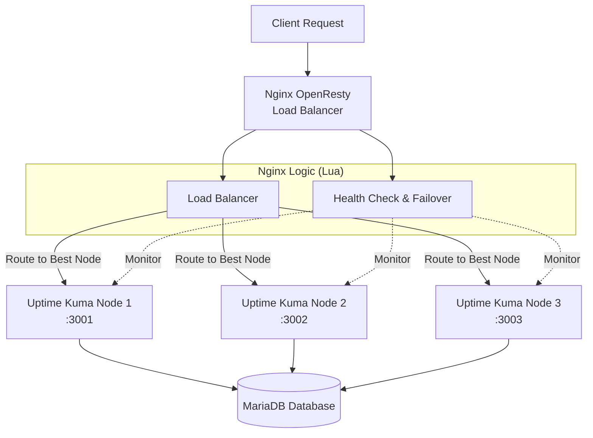
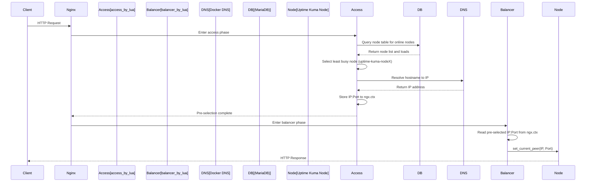

# Uptime Kuma Cluster

<div align="center">


**High-Availability Uptime Kuma Cluster Solution**

📖 [Blog Post (Architecture & Implementation)](https://blog.markkulab.net/implement-uptime-kuma-cluster-vibe-coding/)

🌐 [中文版 Chinese Version](README.md)

</div>

---

## 🆚 Differences from Original Uptime Kuma

| Feature | Original Uptime Kuma | Uptime Kuma Cluster (This Project) |
|:---|:---|:---|
| **Architecture** | Single node | Multi-node HA cluster |
| **Database** | SQLite (local file) | MariaDB (shared database) |
| **Load Balancing** | ❌ None | ✅ OpenResty + Lua smart routing |
| **Failover** | ❌ Service interruption when node fails | ✅ Auto-detect and migrate monitors |
| **Horizontal Scaling** | ❌ Cannot scale | ✅ Dynamic node addition/removal |
| **Monitor Distribution** | Single machine handles all monitors | Auto-distribute to least busy node |
| **Node Health Check** | ❌ None | ✅ Periodic check, auto-mark anomalies |
| **Development/Debug** | Direct connection | ✅ Fixed node routing (Cookie) |
| **RESTful API** | ❌ No cluster management API | ✅ Programmatic monitor creation & management |

> 💡 **In short**: Original Uptime Kuma is "standalone", this project transforms it into a "cluster version", solving single point of failure issues, suitable for production environments requiring high availability.

---

## 📋 Table of Contents

<a id="toc"></a>

| Section | Description |
|:---|:---|
| [🎯 Overview](#-overview) | Project introduction and core features |
| [✨ Extended Features](#-extended-features) | New features compared to original Uptime Kuma |
| [🚀 Quick Start](#-quick-start) | Start cluster in 5 minutes |
| [📘 Usage Guide](#-usage-guide) | Feature introduction from user perspective |
| [🎯 Fixed Node Routing](#-fixed-node-routing) | Node locking for development/debugging |
| [🌐 API Endpoints](#-api-endpoints) | Complete RESTful API list |
| [🏗️ Architecture](#️-architecture) | System architecture and flow diagrams |
| [🔧 Module Description](#-module-description) | Detailed Lua module explanation |
| [⚙️ Configuration](#️-configuration) | Environment variables and config files |
| [🚀 Deployment Guide](#-deployment-guide) | Production deployment steps |
| [📦 Directory Structure](#-directory-structure) | Project file descriptions |
| [❓ FAQ](#-faq) | Troubleshooting |

---

## 🎯 Overview

### ⚡ TL;DR (One-minute Overview)

```
                    ┌─────────────────────────────────────────────────────────┐
                    │                    OpenResty LB                         │
  Client ──────────▶│  Lua: Two-phase routing + Health check + Auto failover │
                    └─────────┬─────────────┬─────────────┬───────────────────┘
                              │             │             │
                              ▼             ▼             ▼
                    ┌─────────────┐ ┌─────────────┐ ┌─────────────┐
                    │   Node 1    │ │   Node 2    │ │   Node 3    │  ← Uptime Kuma Nodes
                    │   :3001     │ │   :3002     │ │   :3003     │
                    └──────┬──────┘ └──────┬──────┘ └──────┬──────┘
                           │               │               │
                           └───────────────┴───────────────┘
                                           │
                                           ▼
                                    ┌─────────────┐
                                    │   MariaDB   │  ← Shared Database
                                    └─────────────┘
```

**Core Value**: Original Uptime Kuma is single-node architecture. This project implements **multi-node high availability** through OpenResty + Lua, automatically migrating monitor tasks when a node fails.

### System Logic Architecture



---

This project is an intelligent load balancing and health check system based on **Nginx OpenResty**, designed for multi-node cluster deployment of **Uptime Kuma**. The system implements application-level logic through Lua scripts, featuring automatic fault detection, failover, intelligent load distribution, and monitor task rebalancing to ensure high availability (HA) of monitoring services.

---

## ✨ Extended Features

This project provides the following additional features on top of native Uptime Kuma:

- **Multi-node HA cluster**: One OpenResty load balancer with multiple Uptime Kuma nodes sharing a MariaDB database.
- **Two-phase smart load balancing**: Picks the best node based on current monitor count and node status using a two-phase Lua routing design.
- **Automatic failover & monitor migration**: Automatically redistributes monitors from failed nodes to healthy ones and restores them when the node recovers.
- **Fixed-node routing (pin to a node)**: Allows routing all traffic to a specific node via Cookie for development, load testing, or debugging.
- **Observability REST APIs**: Exposes cluster status and operations through JSON APIs for scripting and integration.
- **One-command Docker Compose deployment**: Ships with a ready-to-use `docker-compose-cluster.yaml` and OpenResty configuration to spin up the whole cluster quickly.

---

## 🚀 Quick Start

> 📝 **Start the entire HA cluster in 5 minutes!**

### 📋 Prerequisites

| Requirement | Version | Note |
|:---|:---|:---|
| Docker Desktop | Latest | Includes `docker compose` command |
| Node.js | 18+ | Required for single-node development mode |
| PowerShell | 5.1+ | Windows default is fine |

### 🔧 Step 1: Start Cluster

```powershell
# Run in project root
docker compose -f docker-compose-cluster.yaml up -d --build

# Check container status
docker ps
```

> 💡 **Tip**: With Docker Desktop installed, just use `docker compose` command directly.

### 🖥️ Step 2: Single Node Development

```powershell
# Backend (Node.js)
node start-server.js

# Frontend (Vite)
npm run dev
```

### ✅ Step 3: Verify Installation

Open `set-up.http` with VS Code REST Client to test:

```http
GET http://localhost:8084/lb/ping               # LB alive check
GET http://localhost:8084/lb/health             # Cluster health
GET http://localhost:8084/lb/available-nodes    # Available nodes
```

**Expected Results**:
- ✅ `/lb/ping` returns `pong`
- ✅ `/lb/health` returns node health status JSON
- ✅ `/lb/available-nodes` lists all available nodes

[⬆️ Back to Contents](#toc)

---

## 📘 Usage Guide

> 💡 **This section covers the most commonly used features from a user's perspective**

### 📑 Section Navigation

| # | Feature | Description |
|:---|:---|:---|
| 0️⃣ | [Start Cluster](#0️⃣-start-cluster) | One-command Docker Compose startup |
| 1️⃣ | [Load Balancing](#1️⃣-load-balancing) | How requests are distributed to nodes |
| 2️⃣ | [Fixed Node Routing](#2️⃣-fixed-node-routing) | How to pin traffic during development |
| 3️⃣ | [RESTful API](#3️⃣-using-restful-api) | Common JSON APIs |
| 4️⃣ | [.http Testing](#4️⃣-vs-code-http-tests) | One-click testing with VS Code |
| 5️⃣ | [Failover](#5️⃣-failover--recovery) | Auto migration when node fails |

### 0️⃣ Start Cluster

Use Docker Compose to start the entire HA cluster with one command:

```powershell
# Run in project root
docker compose -f docker-compose-cluster.yaml up -d --build
```

This will start the following services:

| Service | Port | Description |
|:---|:---|:---|
| `openresty` | 8084 | Load balancer entry point (external) |
| `uptime-kuma-node1` | 3001 | Uptime Kuma Node 1 |
| `uptime-kuma-node2` | 3002 | Uptime Kuma Node 2 |
| `uptime-kuma-node3` | 3003 | Uptime Kuma Node 3 |
| `mariadb` | 3306 | Shared database |

```powershell
# Check container status
docker ps

# View real-time logs
docker compose -f docker-compose-cluster.yaml logs -f

# Stop cluster
docker compose -f docker-compose-cluster.yaml down
```

> 💡 **Tip**: First startup requires waiting for MariaDB initialization (about 30 seconds). After that, visit `http://localhost:8084` to use the system.

### 1️⃣ Load Balancing

- All requests entering OpenResty go through Lua **two-phase routing**:
  - Access phase: Query DB, calculate current monitor count per node, select the least busy node.
  - Balancer phase: Set this node's IP:Port as the actual upstream target.
- Quick check of current overall status:

```bash
curl http://localhost:8084/lb/health            # Cluster health overview
curl http://localhost:8084/lb/available-nodes   # Each node's status and monitor count
curl http://localhost:8084/lb/load-balancer-status
```

> For more implementation details, see "🏗️ Architecture" and "🔧 Module Description" sections below.

### 2️⃣ Fixed Node Routing

During development, load testing, or debugging, you often need to "hit only one node". Use fixed node routing:

```bash
# Pin traffic to node1 (can open directly in browser)
http://localhost:8084/lb/fixed-node/node1

# Check current fixed node status
curl http://localhost:8084/lb/fixed-node-status

# Clear setting, restore normal load balancing
http://localhost:8084/lb/clear-fixed-node
```

- This mechanism is implemented via Cookie `KUMA_FIXED_NODE`.
- When the specified node goes offline, the system automatically clears the Cookie and restores load balancing.
- See "🎯 Fixed Node Routing" section below for complete documentation and API list.

### 3️⃣ Using RESTful API

OpenResty provides a set of JSON APIs (unified under `/lb/` path) for scripting or system integration:

```bash
# Comprehensive system status (recommended first look)
curl http://localhost:8084/lb/system-status

# View each Uptime Kuma node's current status
curl http://localhost:8084/lb/node-status

# Manually trigger rebalancing
curl http://localhost:8084/lb/trigger-rebalancing
```

- For complete routes and descriptions, see "🌐 API Endpoints" section below.
- For detailed field and response formats, see `API_DOCUMENTATION.md`.

### 4️⃣ VS Code HTTP Tests

The project root provides several `.http` files for one-click testing with VS Code REST Client:

- `set-up.http`: Basic health checks after startup (health, cluster health, available nodes).
- `check-monitors.http`: Sample API calls for querying and operating monitors.

Usage:

1. Open `.http` file in VS Code.
2. Install/enable "REST Client" extension.
3. Click `Send Request` above each section to send.

### 5️⃣ Failover & Recovery

When an Uptime Kuma node fails, the system automatically detects and performs "monitor task migration":

- **Active Health Check**: Calls each node's `/api/v1/health` every 30 seconds.
- **Failure Detection**: After consecutive failed checks, marks the node as `offline`.
- **Automatic Failover**: Via `redistribute_monitors_from_node()`, evenly distributes that node's monitors to other healthy nodes.
- **Node Recovery**: After node returns `online`, `revert_monitors_to_node()` gradually restores previously moved monitors.

Related implementation is mainly in `lua/health_check.lua`. You can also observe current health check and rebalancing status via:

```bash
curl http://localhost:8084/lb/health-status
curl http://localhost:8084/lb/rebalancing-status
```

---

## 🎯 Fixed Node Routing

This feature allows developers to route all requests to a specific node via Cookie for debugging and testing. Clearing the Cookie restores normal load balancing.

### 🔗 Simple URL Operations

The easiest way: visit the following URLs directly in your browser:

| Action | URL | Description |
| :--- | :--- | :--- |
| Set to node1 | `GET /lb/fixed-node/node1` | Route all requests to node1 |
| Set to node2 | `GET /lb/fixed-node/node2` | Route all requests to node2 |
| Set to node3 | `GET /lb/fixed-node/node3` | Route all requests to node3 |
| **Clear setting** | `GET /lb/clear-fixed-node` | Restore load balancing |

### 📝 Usage Example

```bash
# 1. View available nodes
curl http://localhost:8084/lb/available-nodes

# 2. Set fixed node (visit in browser)
# http://localhost:8084/lb/fixed-node/node2

# 3. Verify setting
curl http://localhost:8084/lb/fixed-node-status

# 4. Clear setting (visit in browser)
# http://localhost:8084/lb/clear-fixed-node
```

### 🔧 API Operations

For programmatic operations, use JSON API:

```bash
# Set fixed node
curl -X POST http://localhost:8084/lb/set-fixed-node \
  -H "Content-Type: application/json" \
  -d '{"node": "node2", "expires": 604800}'

# Clear fixed node
curl -X POST http://localhost:8084/lb/clear-fixed-node

# View status
curl http://localhost:8084/lb/fixed-node-status
```

### 📊 Response Headers

After setting a fixed node, all responses will include these headers:

| Header | Value | Description |
| :--- | :--- | :--- |
| `X-Routed-Via` | `fixed-node` or `load-balancer` | Routing method |
| `X-Routed-To` | `uptime-kuma-node2` | Actual routed node |

### ⚠️ Notes

- Cookie name: `KUMA_FIXED_NODE`
- Default expiry: 7 days (customizable via API)
- If the specified node goes offline, the system will automatically clear the Cookie and restore load balancing
- This feature is mainly for development debugging, use cautiously in production
- Check node status: visit `/lb/available-nodes`
- Clear setting: visit `/lb/clear-fixed-node`

---

You can also switch nodes via Web UI by clicking the current node:


## 🌐 API Endpoints

OpenResty provides a series of HTTP APIs for monitoring status and managing the cluster.

### 🔍 Status Monitoring

| Method | Path | Description |
| :--- | :--- | :--- |
| `GET` | `/lb/ping` | Quick check if Nginx load balancer is alive |
| `GET` | `/lb/health` | Returns cluster node health status (from DB query) |
| `GET` | `/lb/health-status` | View heartbeat statistics, failover history |
| `GET` | `/lb/capacity` | Returns monitor count and capacity per node |
| `GET` | `/lb/system-status` | **Recommended**: Returns comprehensive status from all modules |
| `GET` | `/lb/node-status` | Returns detailed status of all backend nodes (Online/Offline/Recovering) |
| `GET` | `/lb/load-balancer-status` | View node load scores, last update time |
| `GET` | `/lb/fault-detection-status` | View fault detection scanner statistics |

### 🎯 Fixed Node Routing API

| Method | Path | Description |
| :--- | :--- | :--- |
| `GET` | `/lb/fixed-node/{node}` | Set fixed node (HTML page) |
| `GET` | `/lb/clear-fixed-node` | Clear fixed node (HTML page) |
| `POST` | `/lb/set-fixed-node` | Set fixed node (JSON API) |
| `POST` | `/lb/clear-fixed-node` | Clear fixed node (JSON API) |
| `GET` | `/lb/fixed-node-status` | View current fixed node status |
| `GET` | `/lb/available-nodes` | List all available nodes |

### ⚙️ Management & Operations

| Method | Path | Description |
| :--- | :--- | :--- |
| `POST` | `/lb/trigger-health-check` | Manually trigger health check |
| `GET` | `/lb/update-loads` | Manually force update load info |
| `GET` | `/lb/trigger-rebalancing` | Manually trigger monitor rebalancing |
| `GET` | `/lb/force-rebalance-all` | **Dangerous**: Force redistribute all monitors |
| `GET` | `/lb/rebalancing-status` | View current rebalancing progress and statistics |
| `GET` | `/lb/debug-config` | View health check debug settings |
| `GET` | `/lb/debug-logs` | View OpenResty debug logs |

---

## 🏗️ Architecture

### Load Balancing Decision Flow

(Two-Phase Lua Routing Architecture)

Due to API limitations in OpenResty's `balancer_by_lua*` phase (cannot use `ngx.socket.tcp()` and other cosocket APIs), the system uses a **two-phase architecture** to implement dynamic routing:



#### Phase Description

| Phase | Nginx Directive | Available APIs | Responsibility |
|:---|:---|:---|:---|
| **Access Phase** | `access_by_lua_block` | ✅ Socket, MySQL, DNS resolution | Query DB to select node, resolve DNS to IP, store in `ngx.ctx` |
| **Balancer Phase** | `balancer_by_lua_block` | ❌ Only `ngx.balancer` API | Read pre-selected result from `ngx.ctx`, call `set_current_peer()` |

#### Detailed Flow

1. **Request arrives**: Nginx `location` receives request.
2. **Access Phase - Pre-select node**: `access_by_lua_block` calls `router.preselect_node()`:
   - Query database `node` and `monitor` tables via `pick_node_for_request()`
   - Count active monitors (`active = 1`) for each `status = 'online'` node
   - Select the online node with "least monitors", map to Docker service name `uptime-kuma-nodeX`
   - Use `resty.dns.resolver` to resolve hostname to IP address
   - Store IP and Port in `ngx.ctx.upstream_host` and `ngx.ctx.upstream_port`
3. **Balancer Phase - Set target**: `balancer_by_lua_block` calls `router.get_preselected_node()`:
   - Read pre-selected IP and Port from `ngx.ctx`
   - Set actual upstream node via `ngx.balancer.set_current_peer(ip, port)`
4. **Backend processing**: Request is forwarded to selected Uptime Kuma node and response completes.

#### Why Two Phases?

OpenResty's `balancer_by_lua*` phase runs during Nginx's connection establishment, when these APIs are disabled:
- `ngx.socket.tcp()` - Cannot establish TCP connections (including MySQL connections)
- `ngx.socket.udp()` - Cannot perform UDP communication
- DNS resolution (depends on socket)

Therefore, all operations requiring network I/O (database queries, DNS resolution) must complete in `access_by_lua*` phase, passing results via `ngx.ctx` (request-level context) to `balancer_by_lua*` phase.

---

## 🔧 Module Description

After refactoring, core logic consists of the following 6 Lua modules:

### Module Architecture

```
lua/
├── config.lua         # Centralized config management (env vars, defaults)
├── db.lua             # Shared database connection module
├── logger.lua         # Shared logging module (unified format, categories)
├── middleware.lua     # Middleware (unified access/header_filter handling)
├── health_check.lua   # Health check and node management
└── monitor_router.lua # Routing decision logic
```

### 1. config.lua - Centralized Config Management

All environment variables and defaults managed centrally, avoiding hardcoding:

```lua
local config = require "config"

-- Database config
config.database.host      -- DB_HOST
config.database.port      -- DB_PORT
config.database.user      -- DB_USER
config.database.password  -- DB_PASSWORD
config.database.database  -- DB_NAME

-- Cluster config
config.cluster.node_count              -- CLUSTER_NODE_COUNT (default: 3)
config.cluster.monitor_limit_per_node  -- MONITOR_LIMIT_PER_NODE (default: 1000)

-- Health check config
config.health_check.interval  -- HEALTH_CHECK_INTERVAL (default: 30s)
config.health_check.timeout   -- HEALTH_CHECK_TIMEOUT (default: 5000ms)
```

### 2. db.lua - Shared Database Module

Unified database connection logic, eliminating duplicate code:

```lua
local db = require "db"

-- Create connection
local conn, err = db.connect()

-- Execute query with auto-close
local res, err = db.query("SELECT * FROM node")
```

### 3. logger.lua - Shared Logging Module

Unified log format and categories:

```lua
local logger = require "logger"

-- Categorized logging
logger.health_check("Node 1 is online")
logger.database("Query executed: %s", sql)
logger.router("Selected node: %s", node_id)
logger.debug("CATEGORY", "Debug info: %s", data)
```

### 4. middleware.lua - Middleware Module

Unified handling of access and header_filter phases, reducing nginx.conf duplication:

```lua
local middleware = require "middleware"

-- Access phase: Pre-select node
middleware.preselect_node()

-- Header Filter phase: Add routing headers
middleware.add_routing_headers()
```

### 5. monitor_router.lua - Routing Decision Logic

Responsible for selecting which Uptime Kuma node to forward requests to.

#### Why "Two Phases"?

Because OpenResty's `balancer_by_lua` phase **prohibits network connections**:

```
┌─────────────────┐      ┌──────────────────┐
│  Access Phase   │ ──▶  │  Balancer Phase  │
│  (can query DB) │      │  (can only set   │
├─────────────────┤      │   target)        │
│ 1. Query DB     │      ├──────────────────┤
│ 2. DNS resolve  │      │ Read ngx.ctx     │
│ 3. Store ngx.ctx│      │ Set IP:Port      │
└─────────────────┘      └──────────────────┘
```

#### Main Functions

| Function | Purpose |
|:---|:---|
| `preselect_node()` | [Access Phase] Query DB to select node → DNS resolve → Store in `ngx.ctx` |
| `get_preselected_node()` | [Balancer Phase] Read IP:Port from `ngx.ctx` |
| `pick_node_for_request()` | Query least busy online node |
| `resolve_host()` | Resolve Docker service name to IP |
| `get_cluster_status()` | Get cluster status |
| `get_node_capacity()` | Get node capacity |

### 6. health_check.lua - Health Check Module

Responsible for maintaining cluster stability and fault handling.

#### Core Responsibilities

- **Node Health Check**: Periodically issue HTTP checks to each node's `/api/v1/health`
- **Fault Detection & Failover**: When node fails consecutive checks, mark as `offline` and redistribute monitor tasks
- **Node Recovery**: After node recovers, restore previously transferred monitor tasks

#### Key Functions

| Function | Purpose |
|:---|:---|
| `run_health_check()` | Execute single health check cycle |
| `health_check_worker()` | Periodic health check background worker |
| `redistribute_monitors_from_node()` | Failover: Redistribute monitor tasks |
| `revert_monitors_to_node()` | Node recovery: Restore monitor tasks |
| `get_all_nodes()` | Query all node statuses |
| `update_node_status()` | Update node status to database |

---

## ⚙️ Configuration

### 1. Environment Variables

Ensure the Nginx runtime environment includes these variables (recommended in `nginx.conf` or Docker `env`):

```bash
# Database config (for Lua connecting to MariaDB)
DB_HOST=mariadb
DB_PORT=3306
DB_USER=kuma
DB_PASSWORD=kuma_pass
DB_NAME=kuma

# Local node identifier
UPTIME_KUMA_NODE_ID=nginx-node
UPTIME_KUMA_NODE_HOST=127.0.0.1
```

### 2. Nginx Shared Memory

Define Lua shared dictionaries in `nginx.conf`'s `http` block (excerpt):

```nginx
http {
    # ...

    # Shared memory zones
    lua_shared_dict health_checker 10m;   # Store health check results and stats
    lua_shared_dict monitor_routing 10m;  # Monitor ID -> node routing cache
    lua_shared_dict node_capacity 1m;     # (Reserved) Node capacity info cache

    # ...
}
```

### 3. Timers

Default timer intervals in Lua scripts:

| Task | Interval |
| :--- | :--- |
| Load Update | `30s` |
| Fault Scan | `10s` |
| Heartbeat | `60s` |
| Failover Check | `60s` |

---

## 🚀 Deployment Guide

### Prerequisites

- **Nginx OpenResty** (Recommended version 1.19+)
- **MariaDB/MySQL** (Data storage for Uptime Kuma)
- **Uptime Kuma** (Configured for multi-node mode)

### Step 1: Deploy Lua Scripts

Copy all modules from `lua` folder to OpenResty's library directory:

```bash
cp lua/*.lua /usr/local/openresty/lualib/
# Or copy individually
cp lua/config.lua /usr/local/openresty/lualib/
cp lua/db.lua /usr/local/openresty/lualib/
cp lua/logger.lua /usr/local/openresty/lualib/
cp lua/middleware.lua /usr/local/openresty/lualib/
cp lua/monitor_router.lua /usr/local/openresty/lualib/
cp lua/health_check.lua /usr/local/openresty/lualib/
```

### Step 2: Configure Nginx

Copy and modify `nginx.conf`:

```bash
cp nginx/nginx.conf /usr/local/openresty/nginx/conf/
```

Ensure `upstream` block correctly points to your Uptime Kuma nodes:

```nginx
upstream uptime_kuma_backend {
    zone uptime_kuma_backend 64k;
    ip_hash; # As baseline, Lua will override this decision
    
    server uptime-kuma-node1:3001 max_fails=3 fail_timeout=30s;
    server uptime-kuma-node2:3002 max_fails=3 fail_timeout=30s;
    server uptime-kuma-node3:3003 max_fails=3 fail_timeout=30s;
    
    keepalive 32;
}
```

### Step 3: Start Services

```bash
# Check config syntax
nginx -t

# Start or reload Nginx
nginx -s reload

# Verify system status
curl http://localhost/api/system-status
```

---

## 🧪 Testing & Tools

- **OpenResty / API Testing**: Use `set-up.http` file for testing
- Supported tools: VS Code REST Client, IntelliJ HTTP Client, Thunder Client

## 📊 Monitoring & Maintenance

To ensure production stability, monitor the following:

1. **Log Monitoring**:
   - `/usr/local/openresty/nginx/logs/error.log`: Monitor for Lua script errors or database connection errors

2. **API Inspection**:
   - Regularly call `/api/node-status` to ensure no nodes are stuck in `recovering` status

3. **Troubleshooting**:
   - 🔍 **Database Connection**: Ensure DB account permissions are correct
   - 🔍 **Network Latency**: If heartbeats frequently timeout, consider increasing `timeout` setting

---

## 🔒 Security Considerations

- **API Access Control**: Recommend restricting `/api/` path access via `allow/deny` directives
- **Database Credentials**: Avoid hardcoding passwords, always use `os.getenv` to read environment variables
- **Fixed Node Feature**: This feature is mainly for development debugging, use cautiously in production

---

## 📦 Directory Structure

| Directory/File | Description |
| :--- | :--- |
| `docker-compose-cluster.yaml` | Compose file for multi-node Uptime Kuma + OpenResty |
| `nginx/`, `nginx.conf` | OpenResty/Nginx main config and site settings |
| `lua/` | Load balancing and health check Lua scripts |
| `server/` | Kuma server-side logic (auth, scheduling, notifications, etc.) |
| `db/` | Database initialization and migration scripts (Knex) |
| `extra/` | Utility tools and scripts |
| `public/`, `src/` | Frontend resources and code |
| `API_DOCUMENTATION.md` | Detailed HTTP API documentation and examples |

---

## ❓ FAQ

- **API returns 502 / 504**:
  - Check `nginx/logs/error.log` for Lua or database connection errors
  - Verify `DB_*` environment variables are set correctly

- **Node repeatedly recovering/offline (Flapping)**:
  - Adjust health check interval or timeout; check network latency and node load

- **Uneven monitor distribution**:
  - Use `/api/trigger-rebalancing` or `/api/force-rebalance-all` for rebalancing

- **Fixed node not working**:
  - Check if node is online: visit `/lb/available-nodes`
  - Clear Cookie: visit `/lb/clear-fixed-node`

[⬆️ Back to Contents](#toc)

---

## 🚀 Performance Optimization (1000+ Monitors)

This section describes optimizations for scaling Uptime Kuma Cluster to support **1000+ monitors** without performance degradation.

### ✅ Completed Optimizations

#### Phase 1 Optimizations (Basic Performance)

| Component | Before | After | Effect |
|-----------|--------|-------|--------|
| **DB Connection Pool** | min: 0, max: 10 | min: 2, max: 50 | 5x concurrent DB queries |
| **Monitor Startup** | Sequential (300-1000ms each) | Batch parallel (50 at a time) | ~90% faster startup |
| **MariaDB Connections** | 151 (default) | 500 | Support multi-node high concurrency |
| **InnoDB Buffer Pool** | default | 512M | Better DB performance |
| **External Ports** | 3001-3005 | 33001-33010 | Avoid port conflicts |

#### Phase 2 Optimizations (High Availability Scaling)

| Component | Before | After | Effect |
|-----------|--------|-------|--------|
| **Redis Cache** | None (Lua shared_dict) | Redis 7-alpine | High-performance distributed cache |
| **Cluster Nodes** | 5 nodes | 10 nodes | 2x capacity |
| **Monitors per Node** | 2000 | 3000 | Up to 30,000 monitors |
| **MariaDB Read Replica** | None | 1 read replica | Distribute read load |
| **Health Check Interval** | 15s | 10s | Faster failover detection |
| **Routing Cache TTL** | 600s | 900s (15 min) | Reduced DB queries |
| **Reconciliation Interval** | Every minute | Every 30s | Faster monitor sync |

### 📊 Performance Improvement Estimates

| Metric | Before Optimization | Phase 1 | Phase 2 |
|--------|---------------------|---------|---------|
| **Max Monitors Supported** | 5,000 | 10,000 | **30,000** |
| **1000 Monitors Startup Time** | 5-17 minutes | ~40 seconds | **~40 seconds** |
| **Concurrent DB Queries** | 10 | 50 | **50** |
| **Failover Detection Speed** | 30 seconds | 15 seconds | **10 seconds** |
| **Monitor Sync Speed** | 60 seconds | 60 seconds | **30 seconds** |

### 📁 Modified Files

#### Phase 1

| File | Changes |
|------|---------|
| `server/database.js` | Increased `mariadbPoolConfig.max` from 10 to 50 |
| `server/server.js` | Changed monitor startup from sequential to batch parallel (50 per batch) |

#### Phase 2

| File | Changes |
|------|---------|
| `lua/config.lua` | Added Redis, read replica config; `node_count=10`, `monitor_limit=3000`, `health_check.interval=10` |
| `lua/redis_cache.lua` | **NEW** - Redis cache module for routing, node status, capacity caching |
| `docker-compose-cluster.yaml` | Added Redis, MariaDB read replica, nodes 6-10 |
| `server/jobs.js` | Reconciliation changed from every minute to every 30s (supports env var) |

### 🔧 Configuration via Environment Variables

All optimizations can be tuned via environment variables:

```bash
# In docker-compose-cluster.yaml or .env file

# Cluster Configuration
CLUSTER_NODE_COUNT=10            # Number of nodes in cluster
MONITOR_LIMIT_PER_NODE=3000      # Max monitors per node
HEALTH_CHECK_INTERVAL=10         # Health check interval in seconds
RECONCILE_INTERVAL_SEC=30        # Reconciliation interval in seconds

# Redis Configuration
REDIS_ENABLED=true               # Enable Redis cache
REDIS_HOST=redis                 # Redis hostname
REDIS_PORT=6379                  # Redis port

# MariaDB Read Replica
DB_REPLICA_ENABLED=true          # Enable read replica
DB_REPLICA_HOST=mariadb-replica  # Read replica hostname
DB_REPLICA_PORT=3306             # Read replica port
```

### 🐳 Architecture Overview

```
                    ┌─────────────┐
                    │   Client    │
                    └──────┬──────┘
                           │
                    ┌──────▼──────┐
                    │  OpenResty  │ :8084
                    │    (LB)     │
                    └──────┬──────┘
                           │
         ┌─────────────────┼─────────────────┐
         │                 │                 │
    ┌────▼────┐       ┌────▼────┐       ┌────▼────┐
    │  Redis  │       │ Node1-10│       │ MariaDB │
    │  :6379  │       │:33001-10│       │  :9090  │
    └─────────┘       └────┬────┘       └────┬────┘
                           │                 │
                           │            ┌────▼────┐
                           └───────────►│ Replica │
                                        │  :9091  │
                                        └─────────┘
```

---

## 📚 Related Documents

| Document | Description |
| :--- | :--- |
| `API_DOCUMENTATION.md` | Complete API specification and examples |
| `CLUSTER_DEPLOYMENT_GUIDE.md` | Cluster deployment and operation guide |
| `PUBLIC_STATUS_PAGINATION_PLAN.md` | Public status page pagination plan |
| `SECURITY.md` | Security guidelines |
| `CODE_OF_CONDUCT.md` | Code of conduct |
| `CONTRIBUTING.md` | Contributing guide |

---

## 📄 License

MIT License - see [LICENSE](LICENSE) file for details.
