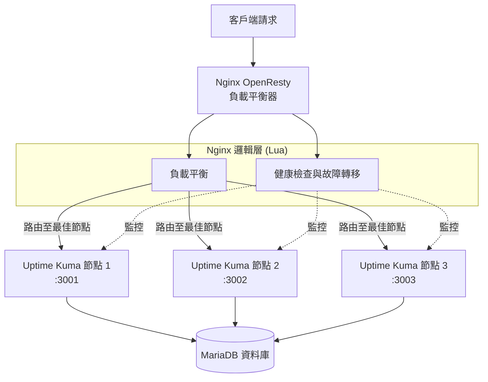
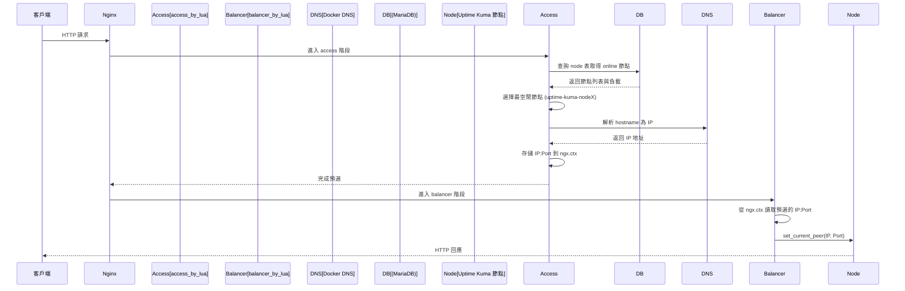

# Uptime Kuma Cluster

<div align="center">


**高可用 Uptime Kuma 集群解決方案**

📖 [部落格詳解（架構與實作心法）](https://blog.markkulab.net/implement-uptime-kuma-cluster-vibe-coding/)

🌐 [English Version](README.en.md)

</div>

---

## 🆚 與原生 Uptime Kuma 的差異

| 功能 | 原生 Uptime Kuma | Uptime Kuma Cluster (本專案) |
|:---|:---|:---|
| **架構** | 單節點 | 多節點高可用集群 |
| **資料庫** | SQLite (本地檔案) | MariaDB (共用資料庫) |
| **負載平衡** | ❌ 無 | ✅ OpenResty + Lua 智能路由 |
| **故障轉移** | ❌ 節點掛掉服務中斷 | ✅ 自動偵測並轉移監控任務 |
| **水平擴展** | ❌ 無法擴展 | ✅ 可動態增減節點 |
| **K8s 自動擴展** | ❌ 無 | ✅ HPA 自動擴縮容 (CPU/Memory) |
| **監控任務分配** | 單機處理所有監控 | 自動分配到最空閒節點 |
| **節點健康檢查** | ❌ 無 | ✅ 定期檢查，異常自動標記 |
| **開發除錯** | 直接連接 | ✅ 支援固定節點路由 (Cookie) |
| **RESTful API** | ❌ 無集群管理 API | ✅ 支援程式自動化建立監控 |

> 💡 **簡單來說**：原生 Uptime Kuma 是「單機版」，本專案將其改造為「集群版」，解決單點故障問題，適合需要高可用性的生產環境。

---

## 📋 目錄

<a id="toc"></a>

| 章節 | 說明 |
|:---|:---|
| [🎯 系統概述](#-系統概述) | 專案介紹與核心功能 |
| [✨ 擴充功能](#-擴充功能一覽) | 相較原生 Uptime Kuma 的新增功能 |
| [🚀 快速開始](#-快速開始) | 5 分鐘內啟動集群 |
| [📘 使用導覽](#-使用導覽) | 從使用者角度的功能介紹 |
| [🎯 固定節點路由](#-固定節點路由) | 開發調試用的節點鎖定功能 |
| [🌐 API 接口](#-api-接口) | RESTful API 完整列表 |
| [🏗️ 架構設計](#️-架構設計) | 系統架構與流程圖 |
| [🔧 模組說明](#-模組說明) | Lua 模組詳細說明 |
| [⚙️ 配置說明](#️-配置說明) | 環境變數與設定檔 |
| [🚀 部署指南](#-部署指南) | 正式環境部署步驟 |
| [☸️ K8s 部署與自動擴展](#️-kubernetes-部署與自動擴展) | Kubernetes HPA 自動擴縮容 |
| [📦 目錄結構](#-目錄導覽) | 專案檔案說明 |
| [❓ 常見問題](#-常見問題) | 疑難排解 |

---

## 🎯 系統概述

### 系統邏輯架構
**核心價值**：原生 Uptime Kuma 是單節點架構，本專案透過 OpenResty + Lua 實現**多節點高可用**，節點掛掉時自動轉移監控任務。



---

本專案是一個基於 **Nginx OpenResty** 的智能負載平衡和健康檢查系統，專為 **Uptime Kuma** 的多節點集群部署而設計。系統透過 Lua 腳本實現了應用層級的邏輯，具備自動故障檢測、故障轉移（Failover）、智能負載分配以及監控任務的重新平衡（Rebalancing）功能，確保監控服務的高可用性（HA）。

-----

## ✨ 擴充功能一覽

這個專案在原生 Uptime Kuma 之上，額外提供：

- **多節點高可用集群**：一組 OpenResty + 多個 Uptime Kuma 節點，共用 MariaDB 資料庫。
- **兩階段智慧負載平衡**：依照每個節點目前的監控數與狀態，動態選擇最合適的節點處理請求。
- **自動容錯與監控轉移**：節點連續健康檢查失敗時，自動把該節點上的監控任務平均分配到其他健康節點，恢復後再搬回。
- **固定節點路由（指定節點）**：支援透過 Cookie 將流量鎖定到指定節點，方便開發、壓測與除錯。
- **可觀測性 REST API**：提供 `/api/system-status`、`/api/node-status`、`/lb/available-nodes` 等 API 供程式或外部系統查詢與操作。
- **一鍵 Docker Compose 部署**：內建 `docker-compose-cluster.yaml`、OpenResty + Lua 設定與健康檢查腳本，快速啟動整個集群。

-----

## 🚀 快速開始

> 📝 **5 分鐘內啟動整個高可用集群！**

### 📋 前置需求

| 需求 | 版本 | 說明 |
|:---|:---|:---|
| Docker Desktop | 最新版 | 包含 `docker compose` 指令 |
| Node.js | 18+ | 單機開發模式需要 |
| PowerShell | 5.1+ | Windows 預設即可 |

### 🐳 方式一：Docker 集群模式（推薦）

```powershell
# 於專案根目錄執行
docker compose -f docker-compose-cluster.yaml up -d --build

# 查看容器狀態
docker ps
```

> 💡 **提示**：已安裝 Docker Desktop 時，直接使用 `docker compose` 指令即可。

### 🖥️ 方式二：單機開發模式

> 適用於本地開發與除錯，不需要啟動完整集群。

```powershell
# 後端 (Node.js)
node start-server.js

# 前端 (Vite)
npm run dev
```

### ✅ 驗證安裝

使用 VS Code REST Client 開啟 `set-up.http` 測試：

```http
GET http://localhost:8084/lb/ping               # OpenResty 存活檢查
GET http://localhost:8084/lb/health             # 集群健康狀態
GET http://localhost:8084/lb/available-nodes    # 可用節點列表
```

**預期結果**：
- ✅ `/lb/ping` 回傳 `pong`
- ✅ `/lb/health` 回傳各節點健康狀態 JSON
- ✅ `/lb/available-nodes` 列出所有可用節點

[⬆️ 返回目錄](#toc)

-----

## 📘 使用導覽

> 💡 **這一節用「從使用者角度」的順序，快速帶過最常用的功能**

### 📑 本節導航

| # | 功能 | 說明 |
|:---|:---|:---|
| 0️⃣ | [啟動集群](#0️⃣-啟動集群) | Docker Compose 一鍵啟動 |
| 1️⃣ | [負載平衡機制](#1️⃣-負載平衡機制) | 請求如何被分配到各節點 |
| 2️⃣ | [指定節點](#2️⃣-指定節點) | 開發除錯時如何固定流量 |
| 3️⃣ | [RESTful API](#3️⃣-使用-restful-api) | 常用的 JSON API |
| 4️⃣ | [.http 測試](#4️⃣-http-測試) | VS Code 一鍵測試 |
| 5️⃣ | [容錯移轉](#5️⃣-容錯移轉機制) | 節點掛掉時的自動移轉 |

### 0️⃣ 啟動集群

使用 Docker Compose 一鍵啟動整個高可用集群：

```powershell
# 於專案根目錄執行
docker compose -f docker-compose-cluster.yaml up -d --build
```

這會啟動以下服務：

| 服務 | Port | 說明 |
|:---|:---|:---|
| `openresty` | 8084 | 負載平衡器入口（對外） |
| `uptime-kuma-node1` | 3001 | Uptime Kuma 節點 1 |
| `uptime-kuma-node2` | 3002 | Uptime Kuma 節點 2 |
| `uptime-kuma-node3` | 3003 | Uptime Kuma 節點 3 |
| `mariadb` | 3306 | 共用資料庫 |

```powershell
# 查看容器運行狀態
docker ps

# 查看即時日誌
docker compose -f docker-compose-cluster.yaml logs -f

# 停止集群
docker compose -f docker-compose-cluster.yaml down
```

> 💡 **提示**：首次啟動需要等待 MariaDB 初始化完成（約 30 秒），之後訪問 `http://localhost:8084` 即可使用。

### 1️⃣ 負載平衡機制

- 所有進入 OpenResty 的請求，會先經過 Lua **兩階段路由**：
  - Access 階段：查 DB、算每個節點的當前監控數，選出最空閒的節點。
  - Balancer 階段：把這個節點的 IP:Port 設成實際 upstream 目標。
- 快速檢查目前整體狀態：

```bash
curl http://localhost:8084/lb/health            # 集群健康概況
curl http://localhost:8084/lb/available-nodes   # 每個節點的狀態與監控數
curl http://localhost:8084/lb/load-balancer-status
```

> 想看更細的實作細節，可往下閱讀「🏗️ 架構設計」與「🔧 模組說明」。

### 2️⃣ 指定節點

開發、壓測或除錯時，常常需要「只打某一台」。可以用固定節點路由：

```bash
# 將流量固定到 node1（瀏覽器可直接開）
http://localhost:8084/lb/fixed-node/node1

# 查看目前固定節點狀態
curl http://localhost:8084/lb/fixed-node-status

# 清除設定，恢復正常負載平衡
http://localhost:8084/lb/clear-fixed-node
```

- 這個機制是透過 Cookie `KUMA_FIXED_NODE` 實作的。
- 指定的節點離線時，系統會自動清掉 Cookie 並恢復負載平衡。
- 下方「🎯 固定節點路由」章節有更完整的說明與 API 列表。

### 3️⃣ 使用 RESTful API

OpenResty 直接提供一組 JSON API（統一在 `/lb/` 路徑下），方便從腳本或其他系統整合：

```bash
# 綜合系統狀態（建議優先看這個）
curl http://localhost:8084/lb/system-status

# 看每個 Uptime Kuma 節點目前狀態
curl http://localhost:8084/lb/node-status

# 手動觸發一次重新平衡
curl http://localhost:8084/lb/trigger-rebalancing
```

- 完整路由與說明請參考下方「🌐 API 接口」章節。
- 更細的欄位與回應格式，則在 `API_DOCUMENTATION.md` 中有詳細定義。

### 4️⃣ `.http` 測試

專案根目錄提供了幾個 `.http` 檔，方便你用 VS Code REST Client 一鍵測試：

- `set-up.http`：啟動後的基本健康檢查（health、cluster health、available nodes）。
- `check-monitors.http`：範例查詢與操作監控的 API 呼叫。

使用方式：

1. 在 VS Code 中開啟 `.http` 檔案。
2. 安裝 / 啟用「REST Client」擴充套件。
3. 點選每一段上方的 `Send Request` 即可發送。

### 5️⃣ 容錯移轉機制

當某個 Uptime Kuma 節點掛掉時，系統會自動偵測並做「監控任務搬家」：

- **主動健康檢查**：每 30 秒呼叫各節點的 `/api/v1/health`。
- **故障判定**：連續多次檢查失敗，會把節點標記為 `offline`。
- **自動故障轉移**：透過 `redistribute_monitors_from_node()`，將該節點上的監控平均分配到其他健康節點。
- **節點恢復**：節點恢復 `online` 後，`revert_monitors_to_node()` 會把先前移走的監控逐步還原。

相關實作主要在 `lua/health_check.lua`，也可以透過：

```bash
curl http://localhost:8084/lb/health-status
curl http://localhost:8084/lb/rebalancing-status
```

來觀察目前健康檢查與重新平衡的狀態。

-----

## 🎯 固定節點路由

此功能允許開發者透過 Cookie 將所有請求固定路由到指定的節點，方便調試和測試。清除 Cookie 後即恢復正常的負載均衡。

### 🔗 簡易 URL 操作

最簡單的方式：直接在瀏覽器訪問以下 URL：

| 操作 | URL | 說明 |
| :--- | :--- | :--- |
| 設定到 node1 | `GET /lb/fixed-node/node1` | 所有請求路由到 node1 |
| 設定到 node2 | `GET /lb/fixed-node/node2` | 所有請求路由到 node2 |
| 設定到 node3 | `GET /lb/fixed-node/node3` | 所有請求路由到 node3 |
| **清除設定** | `GET /lb/clear-fixed-node` | 恢復負載均衡 |

### 📝 使用範例

```bash
# 1. 查看可用節點
curl http://localhost:8084/lb/available-nodes

# 2. 設定固定節點（瀏覽器直接訪問）
# http://localhost:8084/lb/fixed-node/node2

# 3. 驗證設定
curl http://localhost:8084/lb/fixed-node-status

# 4. 清除設定（瀏覽器直接訪問）
# http://localhost:8084/lb/clear-fixed-node
```

### 🔧 API 操作

若需程式化操作，可使用 JSON API：

```bash
# 設定固定節點
curl -X POST http://localhost:8084/lb/set-fixed-node \
  -H "Content-Type: application/json" \
  -d '{"node": "node2", "expires": 604800}'

# 清除固定節點
curl -X POST http://localhost:8084/lb/clear-fixed-node

# 查看狀態
curl http://localhost:8084/lb/fixed-node-status
```

### 📊 Response 標頭

設定固定節點後，所有回應會包含以下標頭：

| Header | 值 | 說明 |
| :--- | :--- | :--- |
| `X-Routed-Via` | `fixed-node` 或 `load-balancer` | 路由方式 |
| `X-Routed-To` | `uptime-kuma-node2` | 實際路由到的節點 |

### ⚠️ 注意事項

- Cookie 名稱：`KUMA_FIXED_NODE`
- 預設有效期：7 天（可透過 API 自訂）
- 若指定的節點離線，系統會自動清除 Cookie 並恢復負載均衡
- 此功能主要用於開發調試，生產環境請謹慎使用
- 檢查節點狀態：訪問 `/lb/available-nodes`
- 清除設定：訪問 `/lb/clear-fixed-node`

-----

也可以透過 Web UI，點擊現在的節點來切換節點：


## 🌐 API 接口

本專案提供兩層 API：**集群管理 API**（OpenResty Lua）與 **Uptime Kuma RESTful API**（監控器 CRUD），支援程式自動化操作。

---

### 🤖 程式自動化監控 RESTful API

> 💡 **適用場景**：CI/CD 自動新增監控、腳本批次管理監控器、外部系統整合

#### 📖 API 文件

| 資源 | 網址 |
|:---|:---|
| **Swagger UI（互動式測試）** | `http://your-uptime-kuma-url/api-docs` |
| **OpenAPI 3.0 JSON** | `http://your-uptime-kuma-url/api-docs.json` |

#### 🔐 認證方式

**方式一：JWT Token（推薦）**

```bash
# 在 API 請求 Header 中帶入 Token
curl -H "Authorization: Bearer YOUR_JWT_TOKEN" \
     http://your-uptime-kuma-url/api/v1/monitors
```

**方式二：API Key**

```bash
# 在「設定」頁面產生 API Key 後使用
curl -H "Authorization: YOUR_API_KEY" \
     http://your-uptime-kuma-url/api/v1/monitors
```

#### 📋 監控器管理 API

| 方法 | 路徑 | 描述 |
|:---|:---|:---|
| `GET` | `/api/v1/status` | 檢查 API 狀態與版本 |
| `GET` | `/api/v1/monitors` | 取得所有監控器列表 |
| `GET` | `/api/v1/monitors/{id}` | 取得特定監控器詳情 |
| `POST` | `/api/v1/monitors` | **建立新監控器** |
| `PUT` | `/api/v1/monitors/{id}` | 更新監控器設定 |
| `DELETE` | `/api/v1/monitors/{id}` | 刪除監控器 |
| `GET` | `/api/v1/monitors/{id}/heartbeats` | 取得監控器心跳歷史 |

#### 🚀 快速範例：建立 HTTP 監控器

```bash
curl -X POST \
  -H "Authorization: Bearer YOUR_JWT_TOKEN" \
  -H "Content-Type: application/json" \
  -d '{
    "name": "My Website",
    "type": "http",
    "url": "https://example.com",
    "interval": 60,
    "active": true
  }' \
  http://your-uptime-kuma-url/api/v1/monitors
```

#### 📊 推送監控（Push Monitor）

適用於 Cron Job、CI/CD Pipeline 主動回報狀態：

```bash
# GET 方式
curl "http://your-uptime-kuma-url/api/push/{pushToken}?status=up&msg=OK&ping=100"

# POST 方式
curl -X POST \
  -H "Content-Type: application/json" \
  -d '{"status": "up", "msg": "Service is running", "ping": 150}' \
  http://your-uptime-kuma-url/api/push/{pushToken}
```

#### 🏷️ 徽章 API（Badge）

嵌入 README 或 Dashboard 顯示監控狀態：

```markdown


```

#### 💻 程式範例

<details>
<summary><b>Python 範例</b></summary>

```python
import requests

class UptimeKumaAPI:
    def __init__(self, base_url, token):
        self.base_url = base_url
        self.headers = {
            'Authorization': f'Bearer {token}',
            'Content-Type': 'application/json'
        }
    
    def get_monitors(self):
        """取得所有監控器"""
        response = requests.get(
            f'{self.base_url}/api/v1/monitors',
            headers=self.headers
        )
        return response.json()
    
    def create_monitor(self, name, url, monitor_type='http', interval=60):
        """建立新監控器"""
        data = {
            'name': name,
            'type': monitor_type,
            'url': url,
            'interval': interval,
            'active': True
        }
        response = requests.post(
            f'{self.base_url}/api/v1/monitors',
            json=data,
            headers=self.headers
        )
        return response.json()

# 使用範例
api = UptimeKumaAPI('http://localhost:8084', 'YOUR_JWT_TOKEN')
monitors = api.get_monitors()
print(f"目前有 {len(monitors.get('data', []))} 個監控器")
```
</details>

<details>
<summary><b>Node.js 範例</b></summary>

```javascript
const axios = require('axios');

const api = axios.create({
  baseURL: 'http://localhost:8084',
  headers: {
    'Authorization': 'Bearer YOUR_JWT_TOKEN',
    'Content-Type': 'application/json'
  }
});

// 取得所有監控器
async function getMonitors() {
  const { data } = await api.get('/api/v1/monitors');
  console.log(`目前有 ${data.data.length} 個監控器`);
  return data;
}

// 建立新監控器
async function createMonitor(name, url) {
  const { data } = await api.post('/api/v1/monitors', {
    name,
    type: 'http',
    url,
    interval: 60,
    active: true
  });
  console.log('已建立監控器:', data);
  return data;
}
```
</details>

<details>
<summary><b>PowerShell 範例</b></summary>

```powershell
$baseUrl = "http://localhost:8084"
$token = "YOUR_JWT_TOKEN"
$headers = @{
    "Authorization" = "Bearer $token"
    "Content-Type" = "application/json"
}

# 取得所有監控器
$monitors = Invoke-RestMethod -Uri "$baseUrl/api/v1/monitors" -Headers $headers
Write-Host "目前有 $($monitors.data.Count) 個監控器"

# 建立新監控器
$body = @{
    name = "My Website"
    type = "http"
    url = "https://example.com"
    interval = 60
    active = $true
} | ConvertTo-Json

$newMonitor = Invoke-RestMethod -Uri "$baseUrl/api/v1/monitors" -Method Post -Headers $headers -Body $body
Write-Host "已建立監控器: $($newMonitor.data.name)"
```
</details>

#### ⚠️ 注意事項

| 項目 | 說明 |
|:---|:---|
| **速率限制** | 每 15 分鐘每 IP 最多 100 個請求，超過返回 `429` |
| **權限** | 使用者只能存取自己建立的監控器 |
| **CORS** | API 支援跨域請求，可從前端直接呼叫 |
| **版本** | 目前為 `v1`，未來版本將保持向後相容 |

> 📄 **完整 API 文件**：請參考 [API_DOCUMENTATION.md](./API_DOCUMENTATION.md)

---

### 🔍 集群管理 API（OpenResty）

OpenResty 提供了一系列 HTTP API 用於監控狀態與管理集群。

#### 狀態監控

| 方法 | 路徑 | 描述 |
| :--- | :--- | :--- |
| `GET` | `/lb/ping` | 快速檢查 Nginx 負載平衡器是否存活 |
| `GET` | `/lb/health` | 返回集群節點的健康狀態（從 DB 查詢）|
| `GET` | `/lb/health-status` | 查看心跳統計、故障轉移歷史記錄 |
| `GET` | `/lb/capacity` | 返回每個節點的監控器數量與容量 |
| `GET` | `/lb/system-status` | **推薦**：返回所有模組的綜合狀態資訊 |
| `GET` | `/lb/node-status` | 返回所有後端節點的詳細狀態 (Online/Offline/Recovering)。 |
| `GET` | `/lb/load-balancer-status` | 查看節點負載分數、最後更新時間。 |
| `GET` | `/lb/fault-detection-status` | 查看故障檢測掃描器的運行統計 |

#### 🎯 固定節點路由 API

| 方法 | 路徑 | 描述 |
| :--- | :--- | :--- |
| `GET` | `/lb/fixed-node/{node}` | 設定固定節點（HTML 頁面）|
| `GET` | `/lb/clear-fixed-node` | 清除固定節點（HTML 頁面）|
| `POST` | `/lb/set-fixed-node` | 設定固定節點（JSON API）|
| `POST` | `/lb/clear-fixed-node` | 清除固定節點（JSON API）|
| `GET` | `/lb/fixed-node-status` | 查看當前固定節點狀態 |
| `GET` | `/lb/available-nodes` | 列出所有可用節點 |

#### ⚙️ 管理與操作

| 方法 | 路徑 | 描述 |
| :--- | :--- | :--- |
| `POST` | `/lb/trigger-health-check` | 手動觸發一次健康檢查 |
| `GET` | `/lb/update-loads` | 手動強制更新負載資訊 |
| `GET` | `/lb/trigger-rebalancing` | 手動觸發一次監控器重新平衡 |
| `GET` | `/lb/force-rebalance-all` | **危險**：強制重新分配所有監控器 |
| `GET` | `/lb/rebalancing-status` | 查看當前重新平衡操作的進度與統計 |
| `GET` | `/lb/debug-config` | 查看健康檢查調試設定 |
| `GET` | `/lb/debug-logs` | 查看 OpenResty 調試日誌 |

-----

## 🏗️ 架構設計

### 負載平衡決策流程

（兩階段 Lua 路由架構）

由於 OpenResty 的 `balancer_by_lua*` 階段有 API 限制（無法使用 `ngx.socket.tcp()` 等 cosocket API），系統採用**兩階段架構**來實現動態路由：



#### 階段說明

| 階段 | Nginx Directive | 可用 API | 職責 |
|:---|:---|:---|:---|
| **Access 階段** | `access_by_lua_block` | ✅ Socket、MySQL、DNS 解析 | 查詢 DB 選擇節點、解析 DNS 為 IP、存入 `ngx.ctx` |
| **Balancer 階段** | `balancer_by_lua_block` | ❌ 僅限 `ngx.balancer` API | 從 `ngx.ctx` 讀取預選結果、呼叫 `set_current_peer()` |

#### 詳細流程

1.  **請求到達**：Nginx `location` 收到請求。
2.  **Access 階段 - 預選節點**：`access_by_lua_block` 呼叫 `router.preselect_node()`：
    - 透過 `pick_node_for_request()` 查詢資料庫 `node` 與 `monitor` 表
    - 統計每個 `status = 'online'` 節點目前 `active = 1` 的監控數量
    - 選擇「監控數量最少」的 online 節點，映射為 Docker 服務名 `uptime-kuma-nodeX`
    - 使用 `resty.dns.resolver` 將 hostname 解析為 IP 地址
    - 將 IP 和 Port 存入 `ngx.ctx.upstream_host` 和 `ngx.ctx.upstream_port`
3.  **Balancer 階段 - 設置目標**：`balancer_by_lua_block` 呼叫 `router.get_preselected_node()`：
    - 從 `ngx.ctx` 讀取預選的 IP 和 Port
    - 透過 `ngx.balancer.set_current_peer(ip, port)` 設置實際上游節點
4.  **後端處理**：請求被轉發至選定的 Uptime Kuma 節點並完成回應。

#### 為什麼需要兩階段？

OpenResty 的 `balancer_by_lua*` 階段運行在 Nginx 的連接建立過程中，此時以下 API 被禁用：
- `ngx.socket.tcp()` - 無法建立 TCP 連接（包括 MySQL 連接）
- `ngx.socket.udp()` - 無法進行 UDP 通信
- DNS 解析（依賴 socket）

因此，所有需要網路 I/O 的操作（資料庫查詢、DNS 解析）必須在 `access_by_lua*` 階段完成，並將結果透過 `ngx.ctx`（請求級別的上下文）傳遞給 `balancer_by_lua*` 階段使用。

-----

## 🔧 模組說明

系統經過重構，核心邏輯由以下 6 個 Lua 模組構成：

### 模組架構

```
lua/
├── config.lua         # 集中配置管理 (環境變數、預設值)
├── db.lua             # 共用資料庫連接模組
├── logger.lua         # 共用日誌模組 (統一格式、分類)
├── middleware.lua     # 中介層 (access/header_filter 統一處理)
├── health_check.lua   # 健康檢查與節點管理
└── monitor_router.lua # 路由決策邏輯
```

### 0\. `ngx` 是什麼？如何在 OpenResty 裡導頁 / 轉發請求

OpenResty 內建一個全域物件 `ngx`，提供：

- **請求/回應控制**：`ngx.var`（讀寫 Nginx 變數）、`ngx.req`（讀取請求）、`ngx.say` / `ngx.print`（輸出內容）、`ngx.status` / `ngx.header`（設定狀態碼與標頭）、`ngx.exit()`（結束請求並回傳特定 HTTP 狀態碼）。
- **請求級別上下文**：`ngx.ctx` 是一個 Lua table，用於在同一請求的不同處理階段之間傳遞資料。本專案用它在 access 階段存儲預選的節點 IP，供 balancer 階段使用。
- **路由與上游選擇**：
  - 在 `access_by_lua_block` 中進行 DB 查詢、DNS 解析等需要 socket 的操作，並將結果存入 `ngx.ctx`。
  - 在 `balancer_by_lua_block` 中使用 `local balancer = require "ngx.balancer"`，再呼叫 `balancer.set_current_peer(ip, port)` 來**動態指定此請求要打到哪一個後端節點**。注意：此階段只能使用 IP 地址，不能使用 hostname。
  - 在 `content_by_lua_block` 中直接產生回應（例如 `/lb/health`、`/lb/capacity`），不用再透過 upstream。
- **計時、排程與共享狀態**：`ngx.now()`（當前時間）、`ngx.timer.at()`（排程背景任務）、`ngx.shared.DICT`（跨請求共享記憶體）。

> ⚠️ **重要限制**：`balancer_by_lua*` 階段無法使用 `ngx.socket.tcp()` 等 cosocket API，因此無法在此階段進行資料庫查詢或 DNS 解析。這就是為什麼本專案採用兩階段架構的原因。

本專案中，**請求實際導向哪一個 `uptime-kuma-nodeX`，由兩階段協作完成**：
1. **Access 階段**：`access_by_lua_block` + `monitor_router.preselect_node()` 查詢 DB、解析 DNS、存入 `ngx.ctx`
2. **Balancer 階段**：`balancer_by_lua_block` + `monitor_router.get_preselected_node()` 讀取 `ngx.ctx`、呼叫 `ngx.balancer.set_current_peer()`

### 1\. config.lua - 集中配置管理

所有環境變數和預設值集中管理，避免硬編碼：

```lua
local config = require "config"

-- 資料庫配置
config.database.host      -- DB_HOST
config.database.port      -- DB_PORT
config.database.user      -- DB_USER
config.database.password  -- DB_PASSWORD
config.database.database  -- DB_NAME

-- 集群配置
config.cluster.node_count              -- CLUSTER_NODE_COUNT (預設: 3)
config.cluster.monitor_limit_per_node  -- MONITOR_LIMIT_PER_NODE (預設: 1000)

-- 健康檢查配置
config.health_check.interval  -- HEALTH_CHECK_INTERVAL (預設: 30秒)
config.health_check.timeout   -- HEALTH_CHECK_TIMEOUT (預設: 5000ms)
```

### 2\. db.lua - 共用資料庫模組

統一的資料庫連接邏輯，消除重複代碼：

```lua
local db = require "db"

-- 建立連接
local conn, err = db.connect()

-- 執行查詢並自動關閉
local res, err = db.query("SELECT * FROM node")
```

### 3\. logger.lua - 共用日誌模組

統一的日誌格式和分類：

```lua
local logger = require "logger"

-- 分類日誌
logger.health_check("Node 1 is online")
logger.database("Query executed: %s", sql)
logger.router("Selected node: %s", node_id)
logger.debug("CATEGORY", "Debug info: %s", data)
```

### 4\. middleware.lua - 中介層模組

統一處理 access 和 header_filter 階段，減少 nginx.conf 重複代碼：

```lua
local middleware = require "middleware"

-- Access 階段：預選節點
middleware.preselect_node()

-- Header Filter 階段：添加路由標頭
middleware.add_routing_headers()
```

### 5\. monitor_router.lua - 路由決策邏輯

負責選擇要把請求轉發到哪個 Uptime Kuma 節點。

#### 為什麼要「兩階段」？

因為 OpenResty 的 `balancer_by_lua` 階段**禁止使用網路連線**，所以：

```
┌─────────────────┐      ┌──────────────────┐
│  Access 階段    │ ──▶  │  Balancer 階段   │
│  (可以查 DB)    │      │  (只能設目標)    │
├─────────────────┤      ├──────────────────┤
│ 1. 查 DB 選節點 │      │ 讀取 ngx.ctx     │
│ 2. DNS 解析成 IP│      │ 設定 IP:Port     │
│ 3. 存到 ngx.ctx │      │                  │
└─────────────────┘      └──────────────────┘
```

#### 主要函數

| 函數 | 用途 |
|:---|:---|
| `preselect_node()` | 【Access 階段】查 DB 選節點 → 解析 DNS → 存入 `ngx.ctx` |
| `get_preselected_node()` | 【Balancer 階段】從 `ngx.ctx` 讀取 IP:Port |
| `pick_node_for_request()` | 查詢最空閒的 online 節點 |
| `resolve_host()` | 將 Docker 服務名解析為 IP |
| `get_cluster_status()` | 取得集群狀態 |
| `get_node_capacity()` | 取得節點容量 |

### 6\. health_check.lua - 健康檢查模組

負責維護集群穩定性與故障處理。

#### 核心職責

- **節點健康檢查**：定期對每個節點的 `/api/v1/health` 發出 HTTP 檢查
- **故障檢測與轉移**：當節點連續多次檢查失敗時，標記為 `offline` 並重新分配監控任務
- **節點恢復**：節點恢復健康後，還原先前轉移的監控任務

#### 關鍵函數

| 函數 | 用途 |
|:---|:---|
| `run_health_check()` | 執行單次健康檢查流程 |
| `health_check_worker()` | 週期性健康檢查背景工作 |
| `redistribute_monitors_from_node()` | 故障轉移：重新分配監控任務 |
| `revert_monitors_to_node()` | 節點恢復：還原監控任務 |
| `get_all_nodes()` | 查詢所有節點狀態 |
| `update_node_status()` | 更新節點狀態到資料庫 |

-----

## ⚙️ 配置說明

### 1\. 環境變數

請確保 Nginx 運行環境中包含以下變數（推薦在 `nginx.conf` 或 Docker `env` 中設置）：

```bash
# 資料庫配置 (用於 Lua 連接 MariaDB)
DB_HOST=mariadb
DB_PORT=3306
DB_USER=kuma
DB_PASSWORD=kuma_pass
DB_NAME=kuma

# 本地節點標識
UPTIME_KUMA_NODE_ID=nginx-node
UPTIME_KUMA_NODE_HOST=127.0.0.1
```

### 2\. Nginx 共享記憶體

在 `nginx.conf` 的 `http` 區塊中定義 Lua 共享字典（節錄）：

```nginx
http {
    # ...

    # 共享記憶體區域
    lua_shared_dict health_checker 10m;   # 存儲健康檢查結果與統計
    lua_shared_dict monitor_routing 10m;  # 監控 ID -> 節點的路由快取
    lua_shared_dict node_capacity 1m;     # （預留）節點容量資訊快取

    # ...
}
```

### 3\. 定時任務

Lua 腳本中預設的定時器間隔：

| 任務 | 間隔 |
| :--- | :--- |
| 負載更新 | `30s` |
| 故障掃描 | `10s` |
| 心跳發送 | `60s` |
| 故障轉移檢查 | `60s` |

-----

## 🚀 部署指南

### 前置需求

- **Nginx OpenResty**（建議版本 1.19+）
- **MariaDB/MySQL**（Uptime Kuma 資料存儲）
- **Uptime Kuma**（已配置多節點模式）

### 步驟 1: 部署 Lua 腳本

將 `lua` 資料夾中的所有模組複製到 OpenResty 的庫目錄：

```bash
cp lua/*.lua /usr/local/openresty/lualib/
# 或個別複製
cp lua/config.lua /usr/local/openresty/lualib/
cp lua/db.lua /usr/local/openresty/lualib/
cp lua/logger.lua /usr/local/openresty/lualib/
cp lua/middleware.lua /usr/local/openresty/lualib/
cp lua/monitor_router.lua /usr/local/openresty/lualib/
cp lua/health_check.lua /usr/local/openresty/lualib/
```

### 步驟 2: 配置 Nginx

複製並修改 `nginx.conf`：

```bash
cp nginx/nginx.conf /usr/local/openresty/nginx/conf/
```

確保 `upstream` 塊正確指向你的 Uptime Kuma 節點：

```nginx
upstream uptime_kuma_backend {
    zone uptime_kuma_backend 64k;
    ip_hash; # 作為基礎，Lua 會覆蓋此決策
    
    server uptime-kuma-node1:3001 max_fails=3 fail_timeout=30s;
    server uptime-kuma-node2:3002 max_fails=3 fail_timeout=30s;
    server uptime-kuma-node3:3003 max_fails=3 fail_timeout=30s;
    
    keepalive 32;
}
```

### 步驟 3: 啟動服務

```bash
# 檢查配置語法
nginx -t

# 啟動或重載 Nginx
nginx -s reload

# 驗證系統狀態
curl http://localhost/api/system-status
```

-----

## ☸️ Kubernetes 部署與自動擴展

本專案支援 Kubernetes 部署，並具備 **HorizontalPodAutoscaler (HPA)** 自動擴縮容能力。

### K8s 自動擴展架構

```
                    ┌─────────────────────────────────────┐
                    │     HorizontalPodAutoscaler         │
                    │   (CPU > 70% 或 Memory > 80%)       │
                    └──────────────┬──────────────────────┘
                                   │ scale up/down
                                   ▼
┌──────────────────────────────────────────────────────────────────┐
│                     StatefulSet: uptime-kuma                      │
│  ┌──────────┐  ┌──────────┐  ┌──────────┐  ┌──────────┐          │
│  │ kuma-0   │  │ kuma-1   │  │ kuma-2   │  │ kuma-N   │  ...     │
│  │ (Primary)│  │          │  │          │  │ (動態新增)│          │
│  └────┬─────┘  └────┬─────┘  └────┬─────┘  └────┬─────┘          │
│       │             │             │             │                 │
│       └─────────────┴──────┬──────┴─────────────┘                 │
│                            │                                      │
│              ┌─────────────┼─────────────┐                        │
│              │  NodeLifecycleManager     │                        │
│              │  • 心跳更新 (30s)         │                        │
│              │  • 離線偵測 (90s)         │                        │
│              │  • Monitor 自動重分配    │                        │
│              └─────────────┬─────────────┘                        │
│                            ▼                                      │
│                    ┌───────────────┐                              │
│                    │   MariaDB     │                              │
│                    │  (節點註冊)   │                              │
│                    └───────────────┘                              │
└──────────────────────────────────────────────────────────────────┘
```

### 自動擴展運作原理

| 階段 | 描述 |
|:---|:---|
| **擴容 (Scale Up)** | 當 CPU > 70% 或 Memory > 80%，HPA 自動新增 Pod |
| **節點註冊** | 新 Pod 啟動後，透過 `initializeFromEnv()` 自動註冊到資料庫 |
| **動態發現** | OpenResty 的 `dynamic_upstream.lua` 每 10 秒從 DB 發現新節點 |
| **流量路由** | 新節點立即加入負載均衡，開始接收請求 |
| **縮容 (Scale Down)** | 當負載降低，HPA 移除 Pod，`NodeLifecycleManager` 偵測離線並重分配 Monitor |

### K8s 部署方式

**方式一：使用 Kustomize**
```bash
cd k8s
kubectl apply -k .
```

**方式二：使用 Helm Chart**
```bash
# 先部署 Secret 和 ConfigMap
kubectl apply -f k8s-deployment-files/secrets/secret.yaml
kubectl apply -f k8s-deployment-files/configmaps/configmap.yaml

# 部署 Helm Chart
helm install uptime-kuma ./k8s-deployment-files/uptime-kuma -n uptime-kuma
```

### HPA 配置參數

```yaml
# k8s/uptime-kuma/hpa.yaml
spec:
  minReplicas: 2          # 最小副本數
  maxReplicas: 10         # 最大副本數
  metrics:
    - type: Resource
      resource:
        name: cpu
        target:
          averageUtilization: 70   # CPU 閾值
    - type: Resource
      resource:
        name: memory
        target:
          averageUtilization: 80   # Memory 閾值
  behavior:
    scaleDown:
      stabilizationWindowSeconds: 300  # 縮容穩定期 5 分鐘
    scaleUp:
      stabilizationWindowSeconds: 60   # 擴容穩定期 1 分鐘
```

### 關鍵檔案

| 檔案 | 說明 |
|:---|:---|
| `k8s/uptime-kuma/hpa.yaml` | HorizontalPodAutoscaler 配置 |
| `k8s/uptime-kuma/pdb.yaml` | PodDisruptionBudget（確保至少 1 Pod 可用）|
| `server/util/node-lifecycle.js` | 節點生命週期管理（心跳、清理、重分配）|
| `lua/dynamic_upstream.lua` | 動態節點發現模組 |
| `server/util/cluster-env.js` | K8s/Docker Compose 環境偵測 |

### 手動擴縮容

```bash
# 手動擴展到 5 個節點
kubectl scale statefulset uptime-kuma -n uptime-kuma --replicas=5

# 查看 HPA 狀態
kubectl get hpa -n uptime-kuma

# 查看節點狀態
kubectl get pods -n uptime-kuma -w
```

-----


## 🧪 測試與工具

- **OpenResty / API 功能測試**：使用 `set-up.http` 檔案進行測試
- 支援工具：VS Code REST Client、IntelliJ HTTP Client、Thunder Client

## 📊 監控與維護

為了確保生產環境的穩定性，建議關注以下指標：

1.  **日誌監控**：
    - `/usr/local/openresty/nginx/logs/error.log`: 關注 Lua 腳本報錯或資料庫連接錯誤

2.  **API 巡檢**：
    - 定期調用 `/api/node-status` 確保沒有節點卡在 `recovering` 狀態過久

3.  **故障排查**：
    - 🔍 **資料庫連接**：確保 DB 帳號權限正確
    - 🔍 **網路延遲**：如果心跳頻繁超時，考慮增加 `timeout` 設定

-----

## 🔒 安全考量

- **API 訪問控制**：建議透過 `allow/deny` 指令限制 `/api/` 路徑訪問
- **資料庫憑證**：避免硬編碼密碼，始終使用 `os.getenv` 讀取環境變數
- **固定節點功能**：此功能主要用於開發調試，生產環境請謹慎使用

-----

## 📦 目錄導覽

| 目錄/檔案 | 說明 |
| :--- | :--- |
| `docker-compose-cluster.yaml` | 啟動多節點 Uptime Kuma + OpenResty 的 Compose 檔 |
| `nginx/`, `nginx.conf` | OpenResty/Nginx 主設定與站台設定 |
| `lua/` | 負載平衡與健康檢查 Lua 腳本 |
| `server/` | Kuma 伺服端邏輯（認證、排程、通知等）|
| `db/` | 資料庫初始化與遷移腳本（Knex）|
| `extra/` | 輔助工具與腳本 |
| `public/`, `src/` | 前端資源與程式碼 |
| `API_DOCUMENTATION.md` | HTTP API 詳細說明與使用範例 |

-----

## ❓ 常見問題

- **API 返回 502 / 504**：
  - 檢查 `nginx/logs/error.log` 是否有 Lua 或資料庫連線錯誤
  - 確認 `DB_*` 環境變數已正確設置

- **節點反覆恢復/離線（Flapping）**：
  - 調整健康檢查間隔或超時；檢查網路延遲與節點負載

- **監控器分佈不均**：
  - 使用 `/api/trigger-rebalancing` 或 `/api/force-rebalance-all` 進行再平衡

- **固定節點無效**：
  - 檢查節點是否在線：訪問 `/lb/available-nodes`
  - 清除 Cookie：訪問 `/lb/clear-fixed-node`

[⬆️ 返回目錄](#toc)

-----

## 📚 相關文件

| 文件 | 說明 |
| :--- | :--- |
| `API_DOCUMENTATION.md` | 完整 API 規範與示例 |
| `CLUSTER_DEPLOYMENT_GUIDE.md` | 集群部署與操作指南 |
| `PUBLIC_STATUS_PAGINATION_PLAN.md` | 公開狀態頁分頁計畫 |
| `SECURITY.md` | 安全規範 |
| `CODE_OF_CONDUCT.md` | 行為準則 |
| `CONTRIBUTING.md` | 貢獻指南 |

-----

## 📄 授權條款

MIT License - 詳見 [LICENSE](LICENSE) 檔案。

