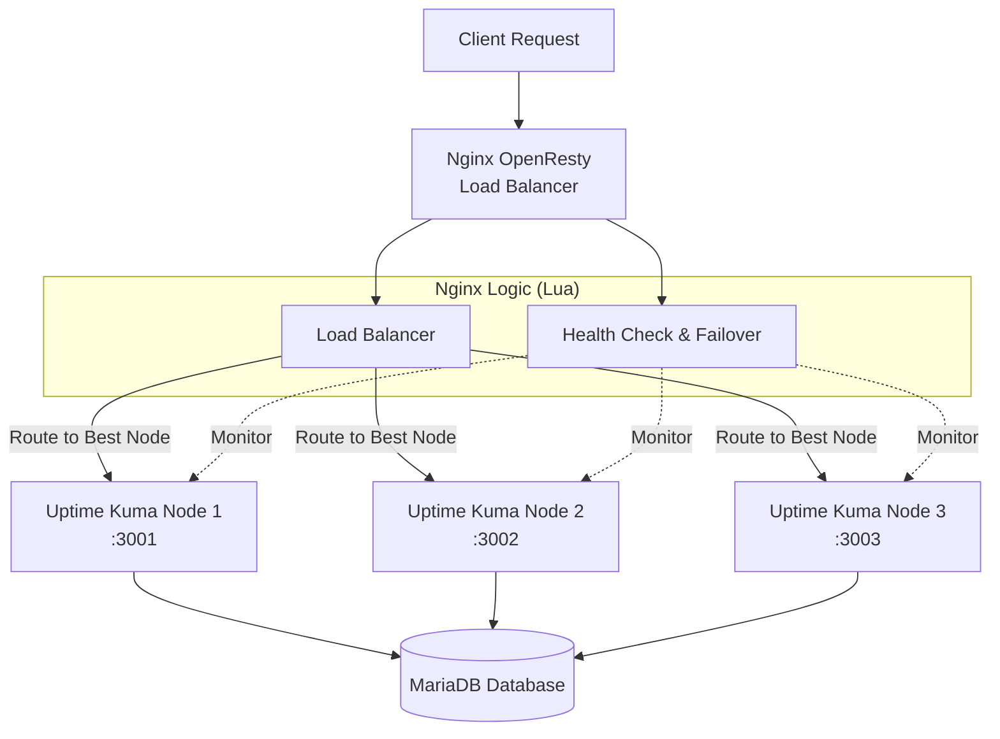

-----

## 🎯 系統概述

本專案是一個基於 **Nginx OpenResty** 的智能負載平衡和健康檢查系統，專為 **Uptime Kuma** 的多節點集群部署而設計。系統透過 Lua 腳本實現了應用層級的邏輯，具備自動故障檢測、故障轉移（Failover）、智能負載分配以及監控任務的重新平衡（Rebalancing）功能，確保監控服務的高可用性（HA）。

- 部落格詳解（架構與實作心法）：https://blog.markkulab.net/implement-uptime-kuma-cluster-vibe-coding/

-----

## 🚀 快速開始（Windows）

- **前置需求**：已安裝 Docker Desktop；已安裝 Node.js 18+；PowerShell 5.1（預設）。
- **啟動三節點叢集 + OpenResty 代理**：

```powershell
# 於專案根目錄執行
& 'C:\Program Files\Docker\Docker\resources\bin\docker.EXE' compose -f 'docker-compose-cluster.yaml' up -d --build

# 查看容器狀態
& 'C:\Program Files\Docker\Docker\resources\bin\docker.EXE' ps

# 檢查健康狀態 API（代理）
Invoke-WebRequest -Uri 'http://localhost/api/system-status' | Select-Object -ExpandProperty Content
```

- **單機開發模式（僅後端 / 前端）**：
  - 後端（Node）：`node start-server.js`
  - 前端（Vite）：`npm run dev`

如需更完整的部署與集群說明，請參考 `CLUSTER_DEPLOYMENT_GUIDE.md` 與 `nginx.conf`。

-----

## ⚡ 功能特性

| 特性 | 描述 |
| :--- | :--- |
| **⚖️ 智能負載平衡（動態 Lua balancer）** | 透過 OpenResty `balancer_by_lua_block`，在每次請求時由 `monitor_router.pick_node_for_request()` 即時計算並選擇後端節點，無需在 `nginx.conf` 中寫死節點列表。 |
| **💓 主動健康檢查** | 系統每 **30 秒**（可配置）對節點進行主動健康檢查，結果寫入資料庫 `node` 表，提供路由決策依據。 |
| **🔄 自動故障轉移** | 當檢測到節點故障（連續 3 次失敗）時，自動將該節點的監控任務轉移至其他健康節點，並更新 DB 狀態。 |
| **🛡️ 節點恢復管理** | 節點恢復健康後，會自動還原先前轉移走的監控任務，避免長期失衡。 |
| **📊 節點容量查詢** | 透過 `/lb/capacity` API 直接從 DB 查詢每個節點當前的監控數量與使用率，方便觀察負載。 |

-----

## 📦 目錄導覽

- `docker-compose-cluster.yaml`：啟動多節點 Uptime Kuma + OpenResty 代理的 Compose 檔。
- `nginx/`、`nginx.conf`：OpenResty/Nginx 主設定與站台設定。
- `lua/`：負載平衡與健康檢查 Lua 腳本。
- `server/`：Kuma 伺服端邏輯（認證、作業排程、通知等）。
- `db/`：資料庫初始化與遷移腳本（Knex）。
- `extra/`：輔助工具與腳本，例如版本更新、健康檢查、範例伺服器等。
- `public/`、`src/`：前端資源與程式碼。
- `API_DOCUMENTATION.md`：HTTP API 詳細說明與使用範例。

-----

## 🏗️ 架構設計

### 系統邏輯架構



### 負載平衡決策流程（動態 Lua balancer 版）

1.  **請求到達**：Nginx `location` 收到請求，統一 `proxy_pass` 到 `upstream uptime_kuma_cluster`。
2.  **Lua 介入**：`balancer_by_lua_block` 透過 `require "monitor_router"` 呼叫 `pick_node_for_request()`。
3.  **查詢節點狀態**：`pick_node_for_request()` 直接查詢資料庫 `node` 表，取得 `status = 'online'` 的節點列表。
4.  **選擇節點**：根據目前在線節點數做簡單輪詢（可擴充為依容量、權重等進階演算法），選出一個 `node_id`，並映射為 Docker 服務名 `uptime-kuma-nodeX`。
5.  **設置目標節點**：Lua 透過 `ngx.balancer.set_current_peer(host, port)` 設置實際上游節點。
6.  **後端處理**：請求被轉發至選定的 Uptime Kuma 節點並完成回應。

-----

## 🔧 模組說明

系統核心邏輯由兩個主要的 Lua 模組構成：

### 1\. 路由與負載平衡模組 (`monitor_router.lua`)

負責處理請求分發邏輯與節點資訊查詢。

  * **核心職責**：
      * **動態節點選擇**：`pick_node_for_request()` 在每次請求時，根據 `node` 表當前的線上節點決定要連到哪一個 `uptime-kuma-nodeX`。
      * **監控路由輔助**：`route_by_monitor_id()` / `route_new_monitor()` 等函式提供基於 DB 的監控分配邏輯（供應用層或之後擴充使用）。
      * **集群資訊查詢**：`get_cluster_status()`、`get_node_capacity()` 直接從 DB 彙總節點狀態與容量，並透過 `/lb/health`、`/lb/capacity` 暴露給前端或外部系統。
  * **關鍵函數**：
      * `pick_node_for_request()`: 提供給 `balancer_by_lua_block` 使用，回傳 `(host, port)` 作為當前請求的實際 upstream。
      * `get_cluster_status()`: 查詢所有節點的狀態與監控數量。
      * `get_node_capacity()`: 查詢每個節點的 monitor 數量與使用百分比。

### 2\. 健康檢查模組 (`health_check.lua`)

負責維護集群穩定性與故障處理。

  * **核心職責**：
      * **節點健康檢查**：定期對每個節點的 `/api/v1/health` 發出 HTTP 檢查。
      * **故障檢測與轉移**：當節點連續多次檢查失敗時，標記為 `offline`，並呼叫 `redistribute_monitors_from_node()` 進行監控任務重新分配。
      * **節點恢復**：節點恢復健康後，透過 `revert_monitors_to_node()` 將先前轉移的監控任務還原。
  * **關鍵函數**：
      * `run_health_check()`: 單次健康檢查流程，更新 DB 與 shared dict。
      * `health_check_worker()`: 以定時 loop 方式週期性執行健康檢查。
      * `get_statistics()`: 提供 `/api/health-status` 使用的統計資訊。

-----

## 🌐 API 接口

openresty 提供了一系列 HTTP API 用於監控狀態與管理集群。

### 🔍 狀態監控

| 方法 | 路徑 | 描述 |
| :--- | :--- | :--- |
| `GET` | `/health` | 返回 Nginx 負載平衡器本身的健康狀態與時間戳。 |
| `GET` | `/api/system-status` | **推薦**：返回所有模組的綜合狀態資訊（包含節點、負載、故障檢測）。 |
| `GET` | `/api/node-status` | 返回所有後端節點的詳細狀態（Online/Offline/Recovering）。 |
| `GET` | `/api/load-balancer-status` | 查看節點負載分數、最後更新時間。 |
| `GET` | `/api/health-check-status` | 查看心跳統計、故障轉移歷史記錄。 |
| `GET` | `/api/fault-detection-status` | 查看故障檢測掃描器的運行統計。 |

### ⚙️ 管理與操作

| 方法 | 路徑 | 描述 |
| :--- | :--- | :--- |
| `GET` | `/api/update-loads` | 手動強制更新負載資訊。 |
| `GET` | `/api/trigger-rebalancing` | 手動觸發一次監控器重新平衡。 |
| `GET` | `/api/force-rebalance-all` | **危險**：強制重新分配所有監控器（用於集群嚴重不平衡時）。 |
| `GET` | `/api/rebalancing-status` | 查看當前重新平衡操作的進度與統計。 |

-----

## ⚙️ 配置說明

### 1\. 環境變數

請確保 Nginx 運行環境中包含以下變數（推薦在 `nginx.conf` 或 Docker `env` 中設置）：

```bash
# 資料庫配置 (用於 Lua 連接 MariaDB)
DB_HOST=mariadb
DB_PORT=3306
DB_USER=kuma
DB_PASSWORD=kuma_pass
DB_NAME=kuma

# 本地節點標識
UPTIME_KUMA_NODE_ID=nginx-node
UPTIME_KUMA_NODE_HOST=127.0.0.1
```

### 2\. Nginx 共享記憶體

在 `nginx.conf` 的 `http` 區塊中定義 Lua 共享字典（節錄）：

```nginx
http {
    # ...

    # 共享記憶體區域
    lua_shared_dict health_checker 10m;   # 存儲健康檢查結果與統計
    lua_shared_dict monitor_routing 10m;  # 監控 ID -> 節點的路由快取
    lua_shared_dict node_capacity 1m;     # （預留）節點容量資訊快取，未必在所有版本中使用

    # ...
}
```

### 3\. 定時任務 (Timers)

Lua 腳本中預設的定時器間隔：

  * **負載更新**: `30s`
  * **故障掃描**: `10s`
  * **心跳發送**: `60s`
  * **故障轉移檢查**: `60s`

-----

## 🚀 部署指南

### 前置需求

  * **Nginx OpenResty** (建議版本 1.19+)
  * **MariaDB/MySQL** (Uptime Kuma 的數據存儲)
  * **Uptime Kuma** (已配置為多節點模式運行)

### 步驟 1: 部署 Lua 腳本

將 `lua` 資料夾中的腳本複製到 OpenResty 的庫目錄：

```bash
cp lua/load_balancer.lua /usr/local/openresty/lualib/
cp lua/health_check.lua /usr/local/openresty/lualib/
```

### 步驟 2: 配置 Nginx

複製並修改 `nginx.conf`：

```bash
cp nginx/nginx.conf /usr/local/openresty/nginx/conf/
```

確保 `upstream` 塊正確指向你的 Uptime Kuma 節點：

```nginx
upstream uptime_kuma_backend {
    zone uptime_kuma_backend 64k;
    ip_hash; # 作為基礎，Lua 會覆蓋此決策
    
    server uptime-kuma-node1:3001 max_fails=3 fail_timeout=30s;
    server uptime-kuma-node2:3002 max_fails=3 fail_timeout=30s;
    server uptime-kuma-node3:3003 max_fails=3 fail_timeout=30s;
    
    keepalive 32;
}
```

### 步驟 3: 啟動服務

```bash
# 檢查配置語法
nginx -t

# 啟動或重載 Nginx
nginx -s reload

# 驗證系統狀態
curl http://localhost/api/system-status
```

-----


## 🧪 測試與工具

- **OpenResty / API 功能測試（HTTP 檔案）**：
  - `set-up.http`：
    - 基本 Kuma API 測試（狀態、Monitors CRUD、狀態頁等）。
    - OpenResty 健康檢查與負載平衡相關端點測試：`/health`、`/api/health-status`、`/api/trigger-health-check`、`/lb/health`、`/lb/capacity`、`/api/debug-config`、`/api/debug-logs`。
    - 建議使用 VS Code REST Client / IntelliJ HTTP Client / Thunder Client 等工具直接開啟並執行。
- **K6 API 壓力測試**：
  - 綜合測試：`k6-api-comprehensive-test.js`
  - 併發建立監控器：`k6-create-100-monitors.js`
  - 單路由壓測：`k6-monitor-test.js`
  - 執行方式（PowerShell）：

```powershell
# 需要已安裝 k6；於專案根目錄
k6 run .\k6-api-comprehensive-test.js
```

## 📊 監控與維護

為了確保生產環境的穩定性，建議關注以下指標：

1.  **日誌監控**：
      * `/usr/local/openresty/nginx/logs/error.log`: 關注 Lua 腳本報錯或資料庫連接錯誤。
2.  **API 巡檢**：
      * 定期調用 `/api/node-status` 確保沒有節點卡在 `recovering` 狀態過久。
3.  **故障排查檢查清單**：
      * 🔍 **資料庫連接**：Lua 腳本依賴直接寫入 DB 來轉移監控器，確保 DB 帳號權限正確。
      * 🔍 **網絡延遲**：如果心跳頻繁超時，考慮增加 `timeout` 設定。

-----

## 🔒 安全考量
-----

## ❓ 常見問題（FAQ）

- **API 返回 502 / 504**：
  - 檢查 `nginx/logs/error.log` 是否有 Lua 或資料庫連線錯誤。
  - 確認 `DB_*` 環境變數已在容器或系統層正確設置。
- **節點反覆恢復/離線（Flapping）**：
  - 調整健康檢查間隔或超時；檢查網路延遲與節點負載。
- **監控器分佈不均**：
  - 使用 `/api/trigger-rebalancing` 或 `/api/force-rebalance-all` 進行再平衡。

-----

## 📚 相關文件

- `API_DOCUMENTATION.md`：完整 API 規範與示例。
- `CLUSTER_DEPLOYMENT_GUIDE.md`：集群部署與操作指南。
- `PUBLIC_STATUS_PAGINATION_PLAN.md`：公開狀態頁分頁計畫。
- `SECURITY.md`、`CODE_OF_CONDUCT.md`、`CONTRIBUTING.md`：安全與貢獻規範。


  * **API 訪問控制**：目前的 API 接口未配置認證，建議在 Nginx 中透過 `allow/deny` 指令限制僅內網 IP 可訪問 `/api/` 路徑，或添加 Basic Auth。
  * **資料庫憑證**：避免將密碼硬編碼在 Lua 腳本中，始終使用 `os.getenv` 讀取環境變數。

