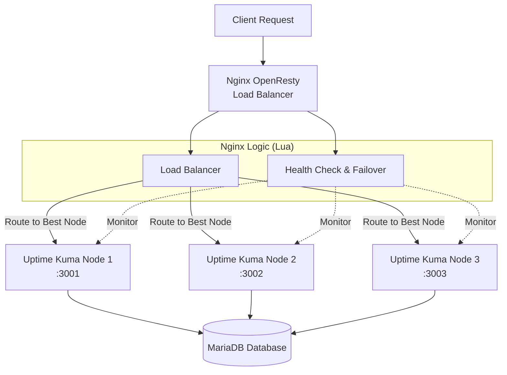
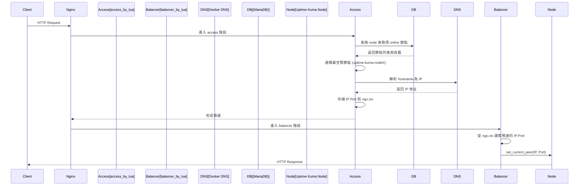

-----

## 🎯 系統概述

本專案是一個基於 **Nginx OpenResty** 的智能負載平衡和健康檢查系統，專為 **Uptime Kuma** 的多節點集群部署而設計。系統透過 Lua 腳本實現了應用層級的邏輯，具備自動故障檢測、故障轉移（Failover）、智能負載分配以及監控任務的重新平衡（Rebalancing）功能，確保監控服務的高可用性（HA），並為了上架自動化，並擴充了restful api 的功能。

- 部落格詳解（架構與實作心法）：https://blog.markkulab.net/implement-uptime-kuma-cluster-vibe-coding/

-----

## 🚀 快速開始（Windows）

- **前置需求**：已安裝 Docker Desktop；已安裝 Node.js 18+；PowerShell 5.1（預設）。
- **啟動三節點叢集 + OpenResty 代理**：

```powershell
# 於專案根目錄執行
docker compose -f docker-compose-cluster.yaml up -d --build

# 查看容器狀態
docker ps
```

> 提示：已安裝 Docker Desktop 時，直接使用 `docker compose` 指令即可，無需指定 `docker.EXE` 路徑。

- **單機開發模式（僅後端 / 前端）**：
  - 後端（Node）：`node start-server.js`
  - 前端（Vite）：`npm run dev`

- **REST Client API 設定 / 測試（`set-up.http`）**：
  - 在 VS Code 安裝「REST Client」擴充套件。
  - 開啟 `set-up.http`，點擊各段落的 `Send Request` 測試以下端點：
    - `GET http://localhost/health`（OpenResty 健康）
    - `GET http://localhost/api/system-status`（系統綜合狀態）
    - 其他 Kuma 與負載平衡相關 API，詳見檔案內註解。

如需更完整的部署與集群說明，請參考 `CLUSTER_DEPLOYMENT_GUIDE.md` 與 `nginx.conf`。

-----

## ⚡ 功能特性

| 特性 | 描述 |
| :--- | :--- |
| **⚖️ 兩階段智能負載平衡** | 採用 access + balancer 兩階段架構：在 `access_by_lua` 階段完成 DB 查詢與 DNS 解析，在 `balancer_by_lua` 階段設置上游節點，完美解決 OpenResty API 限制問題。 |
| **💓 主動健康檢查** | 系統每 **30 秒**（可配置）對節點進行主動健康檢查，結果寫入資料庫 `node` 表，提供路由決策依據。 |
| **🔄 自動故障轉移** | 當檢測到節點故障（連續 3 次失敗）時，自動將該節點的監控任務轉移至其他健康節點，並更新 DB 狀態。 |
| **🛡️ 節點恢復管理** | 節點恢復健康後，會自動還原先前轉移走的監控任務，避免長期失衡。 |
| **📊 節點容量查詢** | 透過 `/lb/capacity` API 直接從 DB 查詢每個節點當前的監控數量與使用率，方便觀察負載。 |
| **🌐 Docker DNS 整合** | 使用 Docker 內建 DNS (127.0.0.11) 解析服務名為 IP，支援容器動態 IP 環境。 |

-----

## 📦 目錄導覽

- `docker-compose-cluster.yaml`：啟動多節點 Uptime Kuma + OpenResty 代理的 Compose 檔。
- `nginx/`、`nginx.conf`：OpenResty/Nginx 主設定與站台設定。
- `lua/`：負載平衡與健康檢查 Lua 腳本。
- `server/`：Kuma 伺服端邏輯（認證、作業排程、通知等）。
- `db/`：資料庫初始化與遷移腳本（Knex）。
- `extra/`：輔助工具與腳本，例如版本更新、健康檢查、範例伺服器等。
- `public/`、`src/`：前端資源與程式碼。
- `API_DOCUMENTATION.md`：HTTP API 詳細說明與使用範例。

-----

## 🏗️ 架構設計

### 系統邏輯架構



### 負載平衡決策流程（兩階段 Lua 路由架構）

由於 OpenResty 的 `balancer_by_lua*` 階段有 API 限制（無法使用 `ngx.socket.tcp()` 等 cosocket API），系統採用**兩階段架構**來實現動態路由：



#### 階段說明

| 階段 | Nginx Directive | 可用 API | 職責 |
|:---|:---|:---|:---|
| **Access 階段** | `access_by_lua_block` | ✅ Socket、MySQL、DNS 解析 | 查詢 DB 選擇節點、解析 DNS 為 IP、存入 `ngx.ctx` |
| **Balancer 階段** | `balancer_by_lua_block` | ❌ 僅限 `ngx.balancer` API | 從 `ngx.ctx` 讀取預選結果、呼叫 `set_current_peer()` |

#### 詳細流程

1.  **請求到達**：Nginx `location` 收到請求。
2.  **Access 階段 - 預選節點**：`access_by_lua_block` 呼叫 `router.preselect_node()`：
    - 透過 `pick_node_for_request()` 查詢資料庫 `node` 與 `monitor` 表
    - 統計每個 `status = 'online'` 節點目前 `active = 1` 的監控數量
    - 選擇「監控數量最少」的 online 節點，映射為 Docker 服務名 `uptime-kuma-nodeX`
    - 使用 `resty.dns.resolver` 將 hostname 解析為 IP 地址
    - 將 IP 和 Port 存入 `ngx.ctx.upstream_host` 和 `ngx.ctx.upstream_port`
3.  **Balancer 階段 - 設置目標**：`balancer_by_lua_block` 呼叫 `router.get_preselected_node()`：
    - 從 `ngx.ctx` 讀取預選的 IP 和 Port
    - 透過 `ngx.balancer.set_current_peer(ip, port)` 設置實際上游節點
4.  **後端處理**：請求被轉發至選定的 Uptime Kuma 節點並完成回應。

#### 為什麼需要兩階段？

OpenResty 的 `balancer_by_lua*` 階段運行在 Nginx 的連接建立過程中，此時以下 API 被禁用：
- `ngx.socket.tcp()` - 無法建立 TCP 連接（包括 MySQL 連接）
- `ngx.socket.udp()` - 無法進行 UDP 通信
- DNS 解析（依賴 socket）

因此，所有需要網路 I/O 的操作（資料庫查詢、DNS 解析）必須在 `access_by_lua*` 階段完成，並將結果透過 `ngx.ctx`（請求級別的上下文）傳遞給 `balancer_by_lua*` 階段使用。

-----

## 🔧 模組說明

系統核心邏輯由兩個主要的 Lua 模組構成：

### 0\. `ngx` 是什麼？如何在 OpenResty 裡導頁 / 轉發請求

OpenResty 內建一個全域物件 `ngx`，提供：

- **請求/回應控制**：`ngx.var`（讀寫 Nginx 變數）、`ngx.req`（讀取請求）、`ngx.say` / `ngx.print`（輸出內容）、`ngx.status` / `ngx.header`（設定狀態碼與標頭）、`ngx.exit()`（結束請求並回傳特定 HTTP 狀態碼）。
- **請求級別上下文**：`ngx.ctx` 是一個 Lua table，用於在同一請求的不同處理階段之間傳遞資料。本專案用它在 access 階段存儲預選的節點 IP，供 balancer 階段使用。
- **路由與上游選擇**：
  - 在 `access_by_lua_block` 中進行 DB 查詢、DNS 解析等需要 socket 的操作，並將結果存入 `ngx.ctx`。
  - 在 `balancer_by_lua_block` 中使用 `local balancer = require "ngx.balancer"`，再呼叫 `balancer.set_current_peer(ip, port)` 來**動態指定此請求要打到哪一個後端節點**。注意：此階段只能使用 IP 地址，不能使用 hostname。
  - 在 `content_by_lua_block` 中直接產生回應（例如 `/lb/health`、`/lb/capacity`），不用再透過 upstream。
- **計時、排程與共享狀態**：`ngx.now()`（當前時間）、`ngx.timer.at()`（排程背景任務）、`ngx.shared.DICT`（跨請求共享記憶體）。

> ⚠️ **重要限制**：`balancer_by_lua*` 階段無法使用 `ngx.socket.tcp()` 等 cosocket API，因此無法在此階段進行資料庫查詢或 DNS 解析。這就是為什麼本專案採用兩階段架構的原因。

本專案中，**請求實際導向哪一個 `uptime-kuma-nodeX`，由兩階段協作完成**：
1. **Access 階段**：`access_by_lua_block` + `monitor_router.preselect_node()` 查詢 DB、解析 DNS、存入 `ngx.ctx`
2. **Balancer 階段**：`balancer_by_lua_block` + `monitor_router.get_preselected_node()` 讀取 `ngx.ctx`、呼叫 `ngx.balancer.set_current_peer()`

### 1\. 路由與負載平衡模組 (`monitor_router.lua`)

負責選擇要把請求轉發到哪個 Uptime Kuma 節點。

#### 為什麼要「兩階段」？

因為 OpenResty 的 `balancer_by_lua` 階段**禁止使用網路連線**，所以：

```
┌─────────────────┐      ┌──────────────────┐
│  Access 階段    │ ──▶  │  Balancer 階段   │
│  (可以查 DB)    │      │  (只能設目標)    │
├─────────────────┤      ├──────────────────┤
│ 1. 查 DB 選節點 │      │ 讀取 ngx.ctx     │
│ 2. DNS 解析成 IP│      │ 設定 IP:Port     │
│ 3. 存到 ngx.ctx │      │                  │
└─────────────────┘      └──────────────────┘
```

#### 主要函數

| 函數 | 用途 |
|:---|:---|
| `preselect_node()` | 【Access 階段】查 DB 選節點 → 解析 DNS → 存入 `ngx.ctx` |
| `get_preselected_node()` | 【Balancer 階段】從 `ngx.ctx` 讀取 IP:Port |
| `pick_node_for_request()` | 查詢最空閒的 online 節點 |
| `resolve_host()` | 將 Docker 服務名解析為 IP |

#### 其他輔助函數

- `route_by_monitor_id()` - 根據監控 ID 查固定節點
- `get_cluster_status()` - 取得集群狀態（供 `/lb/health`）
- `get_node_capacity()` - 取得節點容量（供 `/lb/capacity`）
- `hash_route()` - DB 掛掉時的備援路由

### 2\. 健康檢查模組 (`health_check.lua`)

負責維護集群穩定性與故障處理。

  * **核心職責**：
      * **節點健康檢查**：定期對每個節點的 `/api/v1/health` 發出 HTTP 檢查。
      * **故障檢測與轉移**：當節點連續多次檢查失敗時，標記為 `offline`，並呼叫 `redistribute_monitors_from_node()` 進行監控任務重新分配。
      * **節點恢復**：節點恢復健康後，透過 `revert_monitors_to_node()` 將先前轉移的監控任務還原。
  * **關鍵函數**：
      * `run_health_check()`：單次健康檢查流程，會：
        * 使用 `_M.get_all_nodes()` 查出所有節點與其 `host`、`status`。
        * 對每個節點呼叫 `_M.check_node_health(host)`（透過 `resty.http` 發 HTTP 請求到各節點的 `/api/v1/health`）。
        * 依結果更新 DB `node.status`（`online` / `offline`）、更新 `ngx.shared.health_checker` 裡的統計值與連續成功/失敗次數。
        * 當某節點連續失敗達門檻時，呼叫 `redistribute_monitors_from_node(node_id)` 將該節點上的監控平均分配到其他線上節點。
        * 當某節點連續成功達門檻時，呼叫 `revert_monitors_to_node(node_id)` 將先前轉移走的監控還原。
      * `health_check_worker()`：在 `init_worker_by_lua_block` 中以無限迴圈方式週期性呼叫 `run_health_check()`，並使用 `ngx.sleep(interval)` 控制間隔。
      * `get_statistics()`：從 `ngx.shared.health_checker` 中讀出 `check_count`、`last_check`、`success_count`、`fail_count` 等統計資訊，並透過 `/api/health-status` 暴露給外部。
      * 其他輔助函式：
        * `get_all_nodes()`：查詢 `node` 表取得所有節點的 `node_id`、`host`、`status`。
        * `update_node_status(node_id, status, is_online)`：將節點狀態寫回 DB，並更新 `last_seen` 等欄位。
        * `start_debugger()` / `get_debug_config()`：根據環境變數啟用 Emmy Lua Debugger，並提供 `/api/debug-config` 等除錯資訊。

-----

## 🌐 API 接口

openresty 提供了一系列 HTTP API 用於監控狀態與管理集群。

### 🔍 狀態監控

| 方法 | 路徑 | 描述 |
| :--- | :--- | :--- |
| `GET` | `/health` | 返回 Nginx 負載平衡器本身的健康狀態與時間戳。 |
| `GET` | `/api/system-status` | **推薦**：返回所有模組的綜合狀態資訊（包含節點、負載、故障檢測）。 |
| `GET` | `/api/node-status` | 返回所有後端節點的詳細狀態（Online/Offline/Recovering）。 |
| `GET` | `/api/load-balancer-status` | 查看節點負載分數、最後更新時間。 |
| `GET` | `/api/health-check-status` | 查看心跳統計、故障轉移歷史記錄。 |
| `GET` | `/api/fault-detection-status` | 查看故障檢測掃描器的運行統計。 |

### ⚙️ 管理與操作

| 方法 | 路徑 | 描述 |
| :--- | :--- | :--- |
| `GET` | `/api/update-loads` | 手動強制更新負載資訊。 |
| `GET` | `/api/trigger-rebalancing` | 手動觸發一次監控器重新平衡。 |
| `GET` | `/api/force-rebalance-all` | **危險**：強制重新分配所有監控器（用於集群嚴重不平衡時）。 |
| `GET` | `/api/rebalancing-status` | 查看當前重新平衡操作的進度與統計。 |

-----

## ⚙️ 配置說明

### 1\. 環境變數

請確保 Nginx 運行環境中包含以下變數（推薦在 `nginx.conf` 或 Docker `env` 中設置）：

```bash
# 資料庫配置 (用於 Lua 連接 MariaDB)
DB_HOST=mariadb
DB_PORT=3306
DB_USER=kuma
DB_PASSWORD=kuma_pass
DB_NAME=kuma

# 本地節點標識
UPTIME_KUMA_NODE_ID=nginx-node
UPTIME_KUMA_NODE_HOST=127.0.0.1
```

### 2\. Nginx 共享記憶體

在 `nginx.conf` 的 `http` 區塊中定義 Lua 共享字典（節錄）：

```nginx
http {
    # ...

    # 共享記憶體區域
    lua_shared_dict health_checker 10m;   # 存儲健康檢查結果與統計
    lua_shared_dict monitor_routing 10m;  # 監控 ID -> 節點的路由快取
    lua_shared_dict node_capacity 1m;     # （預留）節點容量資訊快取，未必在所有版本中使用

    # ...
}
```

### 3\. 定時任務 (Timers)

Lua 腳本中預設的定時器間隔：

  * **負載更新**: `30s`
  * **故障掃描**: `10s`
  * **心跳發送**: `60s`
  * **故障轉移檢查**: `60s`

-----

## 🚀 部署指南

### 前置需求

  * **Nginx OpenResty** (建議版本 1.19+)
  * **MariaDB/MySQL** (Uptime Kuma 的數據存儲)
  * **Uptime Kuma** (已配置為多節點模式運行)

### 步驟 1: 部署 Lua 腳本

將 `lua` 資料夾中的腳本複製到 OpenResty 的庫目錄：

```bash
cp lua/load_balancer.lua /usr/local/openresty/lualib/
cp lua/health_check.lua /usr/local/openresty/lualib/
```

### 步驟 2: 配置 Nginx

複製並修改 `nginx.conf`：

```bash
cp nginx/nginx.conf /usr/local/openresty/nginx/conf/
```

確保 `upstream` 塊正確指向你的 Uptime Kuma 節點：

```nginx
upstream uptime_kuma_backend {
    zone uptime_kuma_backend 64k;
    ip_hash; # 作為基礎，Lua 會覆蓋此決策
    
    server uptime-kuma-node1:3001 max_fails=3 fail_timeout=30s;
    server uptime-kuma-node2:3002 max_fails=3 fail_timeout=30s;
    server uptime-kuma-node3:3003 max_fails=3 fail_timeout=30s;
    
    keepalive 32;
}
```

### 步驟 3: 啟動服務

```bash
# 檢查配置語法
nginx -t

# 啟動或重載 Nginx
nginx -s reload

# 驗證系統狀態
curl http://localhost/api/system-status
```

-----


## 🧪 測試與工具

- **OpenResty / API 功能測試（HTTP 檔案）**：
  - `set-up.http`：
    - 基本 Kuma API 測試（狀態、Monitors CRUD、狀態頁等）。
    - OpenResty 健康檢查與負載平衡相關端點測試：`/health`、`/api/health-status`、`/api/trigger-health-check`、`/lb/health`、`/lb/capacity`、`/api/debug-config`、`/api/debug-logs`。
    - 建議使用 VS Code REST Client / IntelliJ HTTP Client / Thunder Client 等工具直接開啟並執行。

## 📊 監控與維護

為了確保生產環境的穩定性，建議關注以下指標：

1.  **日誌監控**：
      * `/usr/local/openresty/nginx/logs/error.log`: 關注 Lua 腳本報錯或資料庫連接錯誤。
2.  **API 巡檢**：
      * 定期調用 `/api/node-status` 確保沒有節點卡在 `recovering` 狀態過久。
3.  **故障排查檢查清單**：
      * 🔍 **資料庫連接**：Lua 腳本依賴直接寫入 DB 來轉移監控器，確保 DB 帳號權限正確。
      * 🔍 **網絡延遲**：如果心跳頻繁超時，考慮增加 `timeout` 設定。

-----

## 🔒 安全考量
-----

## ❓ 常見問題（FAQ）

- **API 返回 502 / 504**：
  - 檢查 `nginx/logs/error.log` 是否有 Lua 或資料庫連線錯誤。
  - 確認 `DB_*` 環境變數已在容器或系統層正確設置。
- **節點反覆恢復/離線（Flapping）**：
  - 調整健康檢查間隔或超時；檢查網路延遲與節點負載。
- **監控器分佈不均**：
  - 使用 `/api/trigger-rebalancing` 或 `/api/force-rebalance-all` 進行再平衡。

-----

## 📚 相關文件

- `API_DOCUMENTATION.md`：完整 API 規範與示例。
- `CLUSTER_DEPLOYMENT_GUIDE.md`：集群部署與操作指南。
- `PUBLIC_STATUS_PAGINATION_PLAN.md`：公開狀態頁分頁計畫。
- `SECURITY.md`、`CODE_OF_CONDUCT.md`、`CONTRIBUTING.md`：安全與貢獻規範。


  * **API 訪問控制**：目前的 API 接口未配置認證，建議在 Nginx 中透過 `allow/deny` 指令限制僅內網 IP 可訪問 `/api/` 路徑，或添加 Basic Auth。
  * **資料庫憑證**：避免將密碼硬編碼在 Lua 腳本中，始終使用 `os.getenv` 讀取環境變數。

