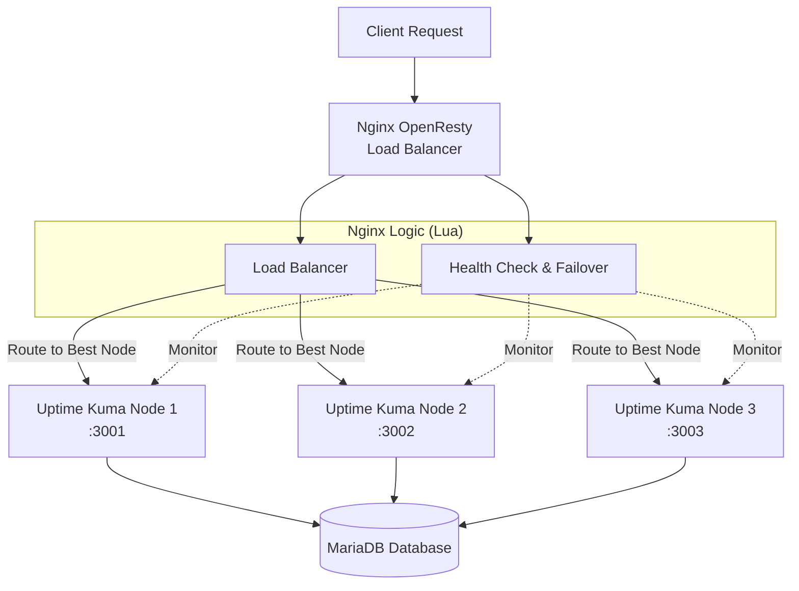

這是一份經過優化、格式整理且語氣更專業的 README 版本。我根據你提供的內容進行了以下改進：

1.  **結構優化**：增加了徽章（Badges）讓視覺更專業，並優化了目錄結構。
2.  **視覺增強**：優化了 ASCII 架構圖的對齊，並為各個章節添加了適當的 Emoji 以提升閱讀體驗。
3.  **代碼區塊**：將原本散落的配置和命令統一放入代碼塊（Code Blocks）中，並標註語言（Lua, Nginx, Bash），方便複製與閱讀。
4.  **API 表格化**：雖然保留了列表，但我將 API 描述整理得更清晰。
5.  **語言潤飾**：將部分用語調整為更標準的技術文檔風格（例如將「幫我修更新」轉化為專業的文檔描述）。

你可以直接複製下面的 Markdown 代碼使用。

-----

# Nginx OpenResty 負載平衡與健康檢查系統 (Uptime Kuma Cluster)

\<div align="center"\>
\
\<p\>
\<strong\>基於 Nginx OpenResty 的智能負載平衡與高可用性解決方案\</strong\>
\</p\>
\<p\>
\<a href="[https://openresty.org/](https://openresty.org/)"\>
\
\</a\>
\<a href="[https://www.lua.org/](https://www.lua.org/)"\>
\
\</a\>
\<a href="[https://uptime.kuma.pet/](https://uptime.kuma.pet/)"\>
\
\</a\>
\</p\>
\</div\>

-----

## 📋 目錄

  - [系統概述](https://www.google.com/search?q=%23-%E7%B3%BB%E7%B5%B1%E6%A6%82%E8%BF%B0)
  - [功能特性](https://www.google.com/search?q=%23-%E5%8A%9F%E8%83%BD%E7%89%B9%E6%80%A7)
  - [架構設計](https://www.google.com/search?q=%23-%E6%9E%B6%E6%A7%8B%E8%A8%AD%E8%A8%88)
  - [模組說明](https://www.google.com/search?q=%23-%E6%A8%A1%E7%B5%84%E8%AA%AA%E6%98%8E)
  - [API 接口](https://www.google.com/search?q=%23-api-%E6%8E%A5%E5%8F%A3)
  - [配置說明](https://www.google.com/search?q=%23-%E9%85%8D%E7%BD%AE%E8%AA%AA%E6%98%8E)
  - [部署指南](https://www.google.com/search?q=%23-%E9%83%A8%E7%BD%B2%E6%8C%87%E5%8D%97)
  - [監控與維護](https://www.google.com/search?q=%23-%E7%9B%A3%E6%8E%A7%E8%88%87%E7%B6%AD%E8%AD%B7)

-----

## 🎯 系統概述

本專案是一個基於 **Nginx OpenResty** 的智能負載平衡和健康檢查系統，專為 **Uptime Kuma** 的多節點集群部署而設計。系統透過 Lua 腳本實現了應用層級的邏輯，具備自動故障檢測、故障轉移（Failover）、智能負載分配以及監控任務的重新平衡（Rebalancing）功能，確保監控服務的高可用性（HA）。

-----

## ⚡ 功能特性

| 特性 | 描述 |
| :--- | :--- |
| **⚖️ 智能負載平衡** | 根據節點當前的監控器數量（Monitor Count）計算負載分數，自動將請求路由至最空閒的節點。 |
| **💓 主動健康檢查** | 系統每 **60秒** 對節點進行一次主動健康檢查，確保節點響應正常。 |
| **🔄 自動故障轉移** | 當檢測到節點故障（連續 3 次失敗）時，自動將該節點的監控任務轉移至其他健康節點。 |
| **🛡️ 節點恢復管理** | 內建 **5分鐘** 的冷靜恢復機制，防止節點頻繁震盪（Flapping）影響系統穩定性。 |
| **⚖️ 監控器再平衡** | 支援手動或自動觸發監控器重新分配，確保長期運行下的集群負載均衡。 |

-----

## 🏗️ 架構設計

### 系統邏輯架構



### 負載平衡決策流程

1.  **請求到達**：Nginx 接收到客戶端請求。
2.  **獲取負載**：Lua 腳本從共享記憶體讀取各節點當前的監控器數量。
3.  **計算分數**：使用公式 `Score = 1 / (monitor_count + 1)` 計算負載分數。
4.  **選擇節點**：選擇分數最高（負載最低）的節點進行路由。
5.  **後端處理**：請求被轉發至選定的 Uptime Kuma 節點。

-----

## 🔧 模組說明

系統核心邏輯由兩個主要的 Lua 模組構成：

### 1\. 負載平衡器 (`load_balancer.lua`)

負責處理請求分發邏輯與負載計算。

  * **核心職責**：
      * **負載決策**：執行節點選擇算法。
      * **狀態更新**：每 **30秒** 更新一次節點的負載資訊。
      * **再平衡**：提供手動觸發重新分配監控器的功能。
  * **關鍵函數**：
      * `balance_load()`: 執行負載平衡邏輯。
      * `get_best_node()`: 比較分數並返回最佳節點。
      * `trigger_manual_rebalancing()`: 觸發監控任務的重新分配。

### 2\. 健康檢查模組 (`health_check.lua`)

負責維護集群穩定性與故障處理。

  * **核心職責**：
      * **心跳機制**：每 **60秒** 發送心跳包。
      * **故障檢測**：每 **10秒** 高頻掃描節點狀態。
      * **故障轉移**：當節點標記為 `offline` 時，執行監控器轉移邏輯。
  * **關鍵函數**：
      * `perform_health_check()`: 執行 HTTP/TCP 探測。
      * `check_nodes_and_handle_failover()`: 核心故障轉移邏輯。
      * `handle_node_failover()`: 具體執行資料庫層面的任務轉移。

-----

## 🌐 API 接口

系統提供了一系列 HTTP API 用於監控狀態與管理集群。

### 🔍 狀態監控

| 方法 | 路徑 | 描述 |
| :--- | :--- | :--- |
| `GET` | `/health` | 返回 Nginx 負載平衡器本身的健康狀態與時間戳。 |
| `GET` | `/api/system-status` | **推薦**：返回所有模組的綜合狀態資訊（包含節點、負載、故障檢測）。 |
| `GET` | `/api/node-status` | 返回所有後端節點的詳細狀態（Online/Offline/Recovering）。 |
| `GET` | `/api/load-balancer-status` | 查看節點負載分數、最後更新時間。 |
| `GET` | `/api/health-check-status` | 查看心跳統計、故障轉移歷史記錄。 |
| `GET` | `/api/fault-detection-status` | 查看故障檢測掃描器的運行統計。 |

### ⚙️ 管理與操作

| 方法 | 路徑 | 描述 |
| :--- | :--- | :--- |
| `GET` | `/api/update-loads` | 手動強制更新負載資訊。 |
| `GET` | `/api/trigger-rebalancing` | 手動觸發一次監控器重新平衡。 |
| `GET` | `/api/force-rebalance-all` | **危險**：強制重新分配所有監控器（用於集群嚴重不平衡時）。 |
| `GET` | `/api/rebalancing-status` | 查看當前重新平衡操作的進度與統計。 |

-----

## ⚙️ 配置說明

### 1\. 環境變數

請確保 Nginx 運行環境中包含以下變數（推薦在 `nginx.conf` 或 Docker `env` 中設置）：

```bash
# 資料庫配置 (用於 Lua 連接 MariaDB)
DB_HOST=mariadb
DB_PORT=3306
DB_USER=kuma
DB_PASSWORD=kuma_pass
DB_NAME=kuma

# 本地節點標識
UPTIME_KUMA_NODE_ID=nginx-node
UPTIME_KUMA_NODE_HOST=127.0.0.1
```

### 2\. Nginx 共享記憶體

在 `nginx.conf` 的 `http` 區塊中定義 Lua 共享字典：

```nginx
http {
    # ... 其他配置
    
    # 分配共享記憶體區域
    lua_shared_dict load_balancer 10m;    # 存儲負載狀態
    lua_shared_dict fault_detector 5m;    # 存儲故障檢測計數
    lua_shared_dict health_checker 5m;    # 存儲健康檢查結果
    
    # ...
}
```

### 3\. 定時任務 (Timers)

Lua 腳本中預設的定時器間隔：

  * **負載更新**: `30s`
  * **故障掃描**: `10s`
  * **心跳發送**: `60s`
  * **故障轉移檢查**: `60s`

-----

## 🚀 部署指南

### 前置需求

  * **Nginx OpenResty** (建議版本 1.19+)
  * **MariaDB/MySQL** (Uptime Kuma 的數據存儲)
  * **Uptime Kuma** (已配置為多節點模式運行)

### 步驟 1: 部署 Lua 腳本

將 `lua` 資料夾中的腳本複製到 OpenResty 的庫目錄：

```bash
cp lua/load_balancer.lua /usr/local/openresty/lualib/
cp lua/health_check.lua /usr/local/openresty/lualib/
```

### 步驟 2: 配置 Nginx

複製並修改 `nginx.conf`：

```bash
cp nginx/nginx.conf /usr/local/openresty/nginx/conf/
```

確保 `upstream` 塊正確指向你的 Uptime Kuma 節點：

```nginx
upstream uptime_kuma_backend {
    zone uptime_kuma_backend 64k;
    ip_hash; # 作為基礎，Lua 會覆蓋此決策
    
    server uptime-kuma-node1:3001 max_fails=3 fail_timeout=30s;
    server uptime-kuma-node2:3002 max_fails=3 fail_timeout=30s;
    server uptime-kuma-node3:3003 max_fails=3 fail_timeout=30s;
    
    keepalive 32;
}
```

### 步驟 3: 啟動服務

```bash
# 檢查配置語法
nginx -t

# 啟動或重載 Nginx
nginx -s reload

# 驗證系統狀態
curl http://localhost/api/system-status
```

-----

## 📊 監控與維護

為了確保生產環境的穩定性，建議關注以下指標：

1.  **日誌監控**：
      * `/usr/local/openresty/nginx/logs/error.log`: 關注 Lua 腳本報錯或資料庫連接錯誤。
2.  **API 巡檢**：
      * 定期調用 `/api/node-status` 確保沒有節點卡在 `recovering` 狀態過久。
3.  **故障排查檢查清單**：
      * 🔍 **資料庫連接**：Lua 腳本依賴直接寫入 DB 來轉移監控器，確保 DB 帳號權限正確。
      * 🔍 **網絡延遲**：如果心跳頻繁超時，考慮增加 `timeout` 設定。

-----

## 🔒 安全考量

  * **API 訪問控制**：目前的 API 接口未配置認證，建議在 Nginx 中透過 `allow/deny` 指令限制僅內網 IP 可訪問 `/api/` 路徑，或添加 Basic Auth。
  * **資料庫憑證**：避免將密碼硬編碼在 Lua 腳本中，始終使用 `os.getenv` 讀取環境變數。

-----

\<div align="center"\>
\<sub\>Made with ❤️ for the Open Source Community\</sub\>
<br>
\<sub\>Version: 1.0.0 | Last Updated: 2024-12\</sub\>
\</div\>

-----

### 💡 下一步

您是否需要我針對其中的「配置說明」部分，提供更完整的 `nginx.conf` 範例代碼，或是詳細解釋 Lua 腳本中如何與 MariaDB 進行互動的？