# Uptime Kuma Cluster

<div align="center">


**高可用 Uptime Kuma 集群解決方案 | High-Availability Uptime Kuma Cluster Solution**

[快速開始 Quick Start](#-快速開始quick-start) • [功能特性 Features](#-功能特性features) • [API 文件 API Docs](#-api-接口api-endpoints) • [部署指南 Deployment](#-部署指南deployment-guide)

</div>

-----

## 🎯 系統概述 | Overview

本專案是一個基於 **Nginx OpenResty** 的智能負載平衡和健康檢查系統，專為 **Uptime Kuma** 的多節點集群部署而設計。系統透過 Lua 腳本實現了應用層級的邏輯，具備自動故障檢測、故障轉移（Failover）、智能負載分配以及監控任務的重新平衡（Rebalancing）功能，確保監控服務的高可用性（HA）。

> This project is an intelligent load balancing and health check system based on **Nginx OpenResty**, designed for multi-node cluster deployment of **Uptime Kuma**. The system implements application-level logic through Lua scripts, featuring automatic fault detection, failover, intelligent load distribution, and monitor task rebalancing to ensure high availability (HA) of monitoring services.

📖 部落格詳解（架構與實作心法）| Blog Post: https://blog.markkulab.net/implement-uptime-kuma-cluster-vibe-coding/

-----

## 🚀 快速開始 | Quick Start

### 前置需求 | Prerequisites
- Docker Desktop 已安裝 | Docker Desktop installed
- Node.js 18+ 已安裝 | Node.js 18+ installed  
- PowerShell 5.1（Windows 預設）| PowerShell 5.1 (Windows default)

### 啟動集群 | Start Cluster

```powershell
# 於專案根目錄執行 | Run in project root
docker compose -f docker-compose-cluster.yaml up -d --build

# 查看容器狀態 | Check container status
docker ps
```

> 💡 提示：已安裝 Docker Desktop 時，直接使用 `docker compose` 指令即可。
> Tip: With Docker Desktop installed, just use `docker compose` command directly.

### 單機開發模式 | Single Node Development

```powershell
# 後端 Backend (Node.js)
node start-server.js

# 前端 Frontend (Vite)
npm run dev
```

### 驗證安裝 | Verify Installation

使用 VS Code REST Client 開啟 `set-up.http` 測試：
> Open `set-up.http` with VS Code REST Client to test:

```http
GET http://localhost:8084/health              # OpenResty 健康狀態 | Health status
GET http://localhost:8084/lb/health           # 集群健康狀態 | Cluster health
GET http://localhost:8084/lb/available-nodes  # 可用節點列表 | Available nodes
```

-----

## ⚡ 功能特性 | Features

| 特性 Feature | 描述 Description |
| :--- | :--- |
| **⚖️ 兩階段智能負載平衡** | 採用 access + balancer 兩階段架構：在 `access_by_lua` 階段完成 DB 查詢與 DNS 解析，在 `balancer_by_lua` 階段設置上游節點。 |
| Two-Phase Smart Load Balancing | Uses access + balancer two-phase architecture: DB queries and DNS resolution in `access_by_lua`, upstream node selection in `balancer_by_lua`. |
| **💓 主動健康檢查** | 系統每 **30 秒**對節點進行主動健康檢查，結果寫入資料庫 `node` 表。 |
| Active Health Check | System performs active health checks on nodes every **30 seconds**, results written to database `node` table. |
| **🔄 自動故障轉移** | 當檢測到節點故障（連續 3 次失敗）時，自動將該節點的監控任務轉移至其他健康節點。 |
| Auto Failover | When node failure is detected (3 consecutive failures), automatically transfers monitoring tasks to other healthy nodes. |
| **🛡️ 節點恢復管理** | 節點恢復健康後，自動還原先前轉移走的監控任務。 |
| Node Recovery Management | After node recovers, automatically restores previously transferred monitoring tasks. |
| **📊 節點容量查詢** | 透過 `/lb/capacity` API 查詢每個節點當前的監控數量與使用率。 |
| Node Capacity Query | Query each node's current monitor count and utilization via `/lb/capacity` API. |
| **🎯 固定節點路由（新功能）** | 透過 Cookie 將請求固定路由到指定節點，方便開發調試。 |
| Fixed Node Routing (New) | Route requests to a specific node via Cookie, convenient for development and debugging. |
| **🌐 Docker DNS 整合** | 使用 Docker 內建 DNS (127.0.0.11) 解析服務名為 IP。 |
| Docker DNS Integration | Uses Docker built-in DNS (127.0.0.11) to resolve service names to IP. |

-----

## 📦 目錄導覽 | Directory Structure

| 目錄/檔案 | 說明 Description |
| :--- | :--- |
| `docker-compose-cluster.yaml` | 啟動多節點 Uptime Kuma + OpenResty 的 Compose 檔 |
| `nginx/`, `nginx.conf` | OpenResty/Nginx 主設定與站台設定 |
| `lua/` | 負載平衡與健康檢查 Lua 腳本 |
| `server/` | Kuma 伺服端邏輯（認證、排程、通知等） |
| `db/` | 資料庫初始化與遷移腳本（Knex） |
| `extra/` | 輔助工具與腳本 |
| `public/`, `src/` | 前端資源與程式碼 |
| `API_DOCUMENTATION.md` | HTTP API 詳細說明與使用範例 |

-----

## 🎯 固定節點路由 | Fixed Node Routing

此功能允許開發者透過 Cookie 將所有請求固定路由到指定的節點，方便調試和測試。清除 Cookie 後即恢復正常的負載均衡。

> This feature allows developers to route all requests to a specific node via Cookie for debugging and testing. Clearing the Cookie restores normal load balancing.

### 🔗 簡易 URL 操作 | Simple URL Operations

最簡單的方式：直接在瀏覽器訪問以下 URL：
> The easiest way: visit the following URLs directly in your browser:

| 操作 Action | URL | 說明 Description |
| :--- | :--- | :--- |
| 設定到 node1 | `GET /lb/fixed-node/node1` | 所有請求路由到 node1 / Route all requests to node1 |
| 設定到 node2 | `GET /lb/fixed-node/node2` | 所有請求路由到 node2 / Route all requests to node2 |
| 設定到 node3 | `GET /lb/fixed-node/node3` | 所有請求路由到 node3 / Route all requests to node3 |
| **清除設定** | `GET /lb/clear-fixed-node` | 恢復負載均衡 / Restore load balancing |

### 📝 使用範例 | Usage Example

```bash
# 1. 查看可用節點 | View available nodes
curl http://localhost:8084/lb/available-nodes

# 2. 設定固定節點（瀏覽器直接訪問）| Set fixed node (visit in browser)
# http://localhost:8084/lb/fixed-node/node2

# 3. 驗證設定 | Verify setting
curl http://localhost:8084/lb/fixed-node-status

# 4. 清除設定（瀏覽器直接訪問）| Clear setting (visit in browser)
# http://localhost:8084/lb/clear-fixed-node
```

### 🔧 API 操作 | API Operations

若需程式化操作，可使用 JSON API：
> For programmatic operations, use JSON API:

```bash
# 設定固定節點 | Set fixed node
curl -X POST http://localhost:8084/lb/set-fixed-node \
  -H "Content-Type: application/json" \
  -d '{"node": "node2", "expires": 604800}'

# 清除固定節點 | Clear fixed node
curl -X POST http://localhost:8084/lb/clear-fixed-node

# 查看狀態 | View status
curl http://localhost:8084/lb/fixed-node-status
```

### 📊 Response 標頭 | Response Headers

設定固定節點後，所有回應會包含以下標頭：
> After setting a fixed node, all responses will include these headers:

| Header | 值 Value | 說明 Description |
| :--- | :--- | :--- |
| `X-Routed-Via` | `fixed-node` 或 `load-balancer` | 路由方式 / Routing method |
| `X-Routed-To` | `uptime-kuma-node2` | 實際路由到的節點 / Actual routed node |

### ⚠️ 注意事項 | Notes

- Cookie 名稱：`KUMA_FIXED_NODE`
- 預設有效期：7 天（可透過 API 自訂）
- 若指定的節點離線，系統會自動清除 Cookie 並恢復負載均衡
- 此功能主要用於開發調試，生產環境請謹慎使用
- 檢查節點狀態：訪問 `/lb/available-nodes`
- 清除設定：訪問 `/lb/clear-fixed-node`

> - Cookie name: `KUMA_FIXED_NODE`
> - Default expiry: 7 days (customizable via API)
> - If the specified node goes offline, the system will automatically clear the Cookie and restore load balancing
> - This feature is mainly for development debugging, use cautiously in production
> - Check node status: visit `/lb/available-nodes`
> - Clear setting: visit `/lb/clear-fixed-node`

-----

## 🏗️ 架構設計 | Architecture

### 系統邏輯架構 | System Logic Architecture


### 負載平衡決策流程 | Load Balancing Decision Flow

（兩階段 Lua 路由架構 | Two-Phase Lua Routing Architecture）

由於 OpenResty 的 `balancer_by_lua*` 階段有 API 限制（無法使用 `ngx.socket.tcp()` 等 cosocket API），系統採用**兩階段架構**來實現動態路由：

```mermaid
sequenceDiagram
    participant Client
    participant Nginx
    participant Access[access_by_lua]
    participant Balancer[balancer_by_lua]
    participant DNS[Docker DNS]
    participant DB[(MariaDB)]
    participant Node[Uptime Kuma Node]

    Client->>Nginx: HTTP Request
    Nginx->>Access: 進入 access 階段
    Access->>DB: 查詢 node 表取得 online 節點
    DB-->>Access: 返回節點列表與負載
    Access->>Access: 選擇最空閒節點 (uptime-kuma-nodeX)
    Access->>DNS: 解析 hostname 為 IP
    DNS-->>Access: 返回 IP 地址
    Access->>Access: 存儲 IP:Port 到 ngx.ctx
    Access-->>Nginx: 完成預選
    Nginx->>Balancer: 進入 balancer 階段
    Balancer->>Balancer: 從 ngx.ctx 讀取預選的 IP:Port
    Balancer->>Node: set_current_peer(IP, Port)
    Node-->>Client: HTTP Response
```



#### 階段說明 | Phase Description

| 階段 | Nginx Directive | 可用 API | 職責 |
|:---|:---|:---|:---|
| **Access 階段** | `access_by_lua_block` | ✅ Socket、MySQL、DNS 解析 | 查詢 DB 選擇節點、解析 DNS 為 IP、存入 `ngx.ctx` |
| **Balancer 階段** | `balancer_by_lua_block` | ❌ 僅限 `ngx.balancer` API | 從 `ngx.ctx` 讀取預選結果、呼叫 `set_current_peer()` |

#### 詳細流程 | Detailed Flow

1.  **請求到達**：Nginx `location` 收到請求。
2.  **Access 階段 - 預選節點**：`access_by_lua_block` 呼叫 `router.preselect_node()`：
    - 透過 `pick_node_for_request()` 查詢資料庫 `node` 與 `monitor` 表
    - 統計每個 `status = 'online'` 節點目前 `active = 1` 的監控數量
    - 選擇「監控數量最少」的 online 節點，映射為 Docker 服務名 `uptime-kuma-nodeX`
    - 使用 `resty.dns.resolver` 將 hostname 解析為 IP 地址
    - 將 IP 和 Port 存入 `ngx.ctx.upstream_host` 和 `ngx.ctx.upstream_port`
3.  **Balancer 階段 - 設置目標**：`balancer_by_lua_block` 呼叫 `router.get_preselected_node()`：
    - 從 `ngx.ctx` 讀取預選的 IP 和 Port
    - 透過 `ngx.balancer.set_current_peer(ip, port)` 設置實際上游節點
4.  **後端處理**：請求被轉發至選定的 Uptime Kuma 節點並完成回應。

#### 為什麼需要兩階段？| Why Two Phases?

OpenResty 的 `balancer_by_lua*` 階段運行在 Nginx 的連接建立過程中，此時以下 API 被禁用：
- `ngx.socket.tcp()` - 無法建立 TCP 連接（包括 MySQL 連接）
- `ngx.socket.udp()` - 無法進行 UDP 通信
- DNS 解析（依賴 socket）

因此，所有需要網路 I/O 的操作（資料庫查詢、DNS 解析）必須在 `access_by_lua*` 階段完成，並將結果透過 `ngx.ctx`（請求級別的上下文）傳遞給 `balancer_by_lua*` 階段使用。

-----

## 🔧 模組說明 | Module Description

系統經過重構，核心邏輯由以下 6 個 Lua 模組構成：

### 模組架構 | Module Architecture

```
lua/
├── config.lua         # 集中配置管理 (環境變數、預設值)
├── db.lua             # 共用資料庫連接模組
├── logger.lua         # 共用日誌模組 (統一格式、分類)
├── middleware.lua     # 中介層 (access/header_filter 統一處理)
├── health_check.lua   # 健康檢查與節點管理
└── monitor_router.lua # 路由決策邏輯
```

### 0\. `ngx` 是什麼？如何在 OpenResty 裡導頁 / 轉發請求

OpenResty 內建一個全域物件 `ngx`，提供：

- **請求/回應控制**：`ngx.var`（讀寫 Nginx 變數）、`ngx.req`（讀取請求）、`ngx.say` / `ngx.print`（輸出內容）、`ngx.status` / `ngx.header`（設定狀態碼與標頭）、`ngx.exit()`（結束請求並回傳特定 HTTP 狀態碼）。
- **請求級別上下文**：`ngx.ctx` 是一個 Lua table，用於在同一請求的不同處理階段之間傳遞資料。本專案用它在 access 階段存儲預選的節點 IP，供 balancer 階段使用。
- **路由與上游選擇**：
  - 在 `access_by_lua_block` 中進行 DB 查詢、DNS 解析等需要 socket 的操作，並將結果存入 `ngx.ctx`。
  - 在 `balancer_by_lua_block` 中使用 `local balancer = require "ngx.balancer"`，再呼叫 `balancer.set_current_peer(ip, port)` 來**動態指定此請求要打到哪一個後端節點**。注意：此階段只能使用 IP 地址，不能使用 hostname。
  - 在 `content_by_lua_block` 中直接產生回應（例如 `/lb/health`、`/lb/capacity`），不用再透過 upstream。
- **計時、排程與共享狀態**：`ngx.now()`（當前時間）、`ngx.timer.at()`（排程背景任務）、`ngx.shared.DICT`（跨請求共享記憶體）。

> ⚠️ **重要限制**：`balancer_by_lua*` 階段無法使用 `ngx.socket.tcp()` 等 cosocket API，因此無法在此階段進行資料庫查詢或 DNS 解析。這就是為什麼本專案採用兩階段架構的原因。

本專案中，**請求實際導向哪一個 `uptime-kuma-nodeX`，由兩階段協作完成**：
1. **Access 階段**：`access_by_lua_block` + `monitor_router.preselect_node()` 查詢 DB、解析 DNS、存入 `ngx.ctx`
2. **Balancer 階段**：`balancer_by_lua_block` + `monitor_router.get_preselected_node()` 讀取 `ngx.ctx`、呼叫 `ngx.balancer.set_current_peer()`

### 1\. config.lua - 集中配置管理

所有環境變數和預設值集中管理，避免硬編碼：

```lua
local config = require "config"

-- 資料庫配置
config.database.host      -- DB_HOST
config.database.port      -- DB_PORT
config.database.user      -- DB_USER
config.database.password  -- DB_PASSWORD
config.database.database  -- DB_NAME

-- 集群配置
config.cluster.node_count              -- CLUSTER_NODE_COUNT (預設: 3)
config.cluster.monitor_limit_per_node  -- MONITOR_LIMIT_PER_NODE (預設: 1000)

-- 健康檢查配置
config.health_check.interval  -- HEALTH_CHECK_INTERVAL (預設: 30秒)
config.health_check.timeout   -- HEALTH_CHECK_TIMEOUT (預設: 5000ms)
```

### 2\. db.lua - 共用資料庫模組

統一的資料庫連接邏輯，消除重複代碼：

```lua
local db = require "db"

-- 建立連接
local conn, err = db.connect()

-- 執行查詢並自動關閉
local res, err = db.query("SELECT * FROM node")
```

### 3\. logger.lua - 共用日誌模組

統一的日誌格式和分類：

```lua
local logger = require "logger"

-- 分類日誌
logger.health_check("Node 1 is online")
logger.database("Query executed: %s", sql)
logger.router("Selected node: %s", node_id)
logger.debug("CATEGORY", "Debug info: %s", data)
```

### 4\. middleware.lua - 中介層模組

統一處理 access 和 header_filter 階段，減少 nginx.conf 重複代碼：

```lua
local middleware = require "middleware"

-- Access 階段：預選節點
middleware.preselect_node()

-- Header Filter 階段：添加路由標頭
middleware.add_routing_headers()
```

### 5\. monitor_router.lua - 路由決策邏輯

負責選擇要把請求轉發到哪個 Uptime Kuma 節點。

#### 為什麼要「兩階段」？

因為 OpenResty 的 `balancer_by_lua` 階段**禁止使用網路連線**，所以：

```
┌─────────────────┐      ┌──────────────────┐
│  Access 階段    │ ──▶  │  Balancer 階段   │
│  (可以查 DB)    │      │  (只能設目標)    │
├─────────────────┤      ├──────────────────┤
│ 1. 查 DB 選節點 │      │ 讀取 ngx.ctx     │
│ 2. DNS 解析成 IP│      │ 設定 IP:Port     │
│ 3. 存到 ngx.ctx │      │                  │
└─────────────────┘      └──────────────────┘
```

#### 主要函數

| 函數 | 用途 |
|:---|:---|
| `preselect_node()` | 【Access 階段】查 DB 選節點 → 解析 DNS → 存入 `ngx.ctx` |
| `get_preselected_node()` | 【Balancer 階段】從 `ngx.ctx` 讀取 IP:Port |
| `pick_node_for_request()` | 查詢最空閒的 online 節點 |
| `resolve_host()` | 將 Docker 服務名解析為 IP |
| `get_cluster_status()` | 取得集群狀態 |
| `get_node_capacity()` | 取得節點容量 |

### 6\. health_check.lua - 健康檢查模組

負責維護集群穩定性與故障處理。

#### 核心職責

- **節點健康檢查**：定期對每個節點的 `/api/v1/health` 發出 HTTP 檢查
- **故障檢測與轉移**：當節點連續多次檢查失敗時，標記為 `offline` 並重新分配監控任務
- **節點恢復**：節點恢復健康後，還原先前轉移的監控任務

#### 關鍵函數

| 函數 | 用途 |
|:---|:---|
| `run_health_check()` | 執行單次健康檢查流程 |
| `health_check_worker()` | 週期性健康檢查背景工作 |
| `redistribute_monitors_from_node()` | 故障轉移：重新分配監控任務 |
| `revert_monitors_to_node()` | 節點恢復：還原監控任務 |
| `get_all_nodes()` | 查詢所有節點狀態 |
| `update_node_status()` | 更新節點狀態到資料庫 |

-----

## 🌐 API 接口 | API Endpoints

OpenResty 提供了一系列 HTTP API 用於監控狀態與管理集群。
> OpenResty provides a series of HTTP APIs for monitoring status and managing the cluster.

### 🔍 狀態監控 | Status Monitoring

| 方法 | 路徑 | 描述 |
| :--- | :--- | :--- |
| `GET` | `/health` | 返回 Nginx 負載平衡器本身的健康狀態與時間戳。 |
| `GET` | `/api/system-status` | **推薦**：返回所有模組的綜合狀態資訊（包含節點、負載、故障檢測）。 |
| `GET` | `/api/node-status` | 返回所有後端節點的詳細狀態（Online/Offline/Recovering）。 |
| `GET` | `/api/load-balancer-status` | 查看節點負載分數、最後更新時間。 |
| `GET` | `/api/health-check-status` | 查看心跳統計、故障轉移歷史記錄。 |
| `GET` | `/api/fault-detection-status` | 查看故障檢測掃描器的運行統計。 |

### 🎯 固定節點路由 | Fixed Node Routing

| 方法 Method | 路徑 Path | 描述 Description |
| :--- | :--- | :--- |
| `GET` | `/lb/fixed-node/{node}` | 設定固定節點（HTML 頁面）/ Set fixed node (HTML page) |
| `GET` | `/lb/clear-fixed-node` | 清除固定節點（HTML 頁面）/ Clear fixed node (HTML page) |
| `POST` | `/lb/set-fixed-node` | 設定固定節點（JSON API）/ Set fixed node (JSON API) |
| `POST` | `/lb/clear-fixed-node` | 清除固定節點（JSON API）/ Clear fixed node (JSON API) |
| `GET` | `/lb/fixed-node-status` | 查看當前固定節點狀態 / View current fixed node status |
| `GET` | `/lb/available-nodes` | 列出所有可用節點 / List all available nodes |

### ⚙️ 管理與操作 | Management & Operations

| 方法 | 路徑 | 描述 |
| :--- | :--- | :--- |
| `GET` | `/api/update-loads` | 手動強制更新負載資訊。 |
| `GET` | `/api/trigger-rebalancing` | 手動觸發一次監控器重新平衡。 |
| `GET` | `/api/force-rebalance-all` | **危險**：強制重新分配所有監控器（用於集群嚴重不平衡時）。 |
| `GET` | `/api/rebalancing-status` | 查看當前重新平衡操作的進度與統計。 |

-----

## ⚙️ 配置說明 | Configuration

### 1\. 環境變數 | Environment Variables

請確保 Nginx 運行環境中包含以下變數（推薦在 `nginx.conf` 或 Docker `env` 中設置）：

```bash
# 資料庫配置 (用於 Lua 連接 MariaDB)
DB_HOST=mariadb
DB_PORT=3306
DB_USER=kuma
DB_PASSWORD=kuma_pass
DB_NAME=kuma

# 本地節點標識
UPTIME_KUMA_NODE_ID=nginx-node
UPTIME_KUMA_NODE_HOST=127.0.0.1
```

### 2\. Nginx 共享記憶體 | Nginx Shared Memory

在 `nginx.conf` 的 `http` 區塊中定義 Lua 共享字典（節錄）：

```nginx
http {
    # ...

    # 共享記憶體區域
    lua_shared_dict health_checker 10m;   # 存儲健康檢查結果與統計
    lua_shared_dict monitor_routing 10m;  # 監控 ID -> 節點的路由快取
    lua_shared_dict node_capacity 1m;     # （預留）節點容量資訊快取，未必在所有版本中使用

    # ...
}
```

### 3\. 定時任務 | Timers

Lua 腳本中預設的定時器間隔 | Default timer intervals in Lua scripts:

| 任務 Task | 間隔 Interval |
| :--- | :--- |
| 負載更新 Load Update | `30s` |
| 故障掃描 Fault Scan | `10s` |
| 心跳發送 Heartbeat | `60s` |
| 故障轉移檢查 Failover Check | `60s` |

-----

## 🚀 部署指南 | Deployment Guide

### 前置需求 | Prerequisites

- **Nginx OpenResty** (建議版本 1.19+ | Recommended version 1.19+)
- **MariaDB/MySQL** (Uptime Kuma 資料存儲 | Data storage for Uptime Kuma)
- **Uptime Kuma** (已配置多節點模式 | Configured for multi-node mode)

### 步驟 1: 部署 Lua 腳本 | Step 1: Deploy Lua Scripts

將 `lua` 資料夾中的所有模組複製到 OpenResty 的庫目錄：

```bash
cp lua/*.lua /usr/local/openresty/lualib/
# 或個別複製
cp lua/config.lua /usr/local/openresty/lualib/
cp lua/db.lua /usr/local/openresty/lualib/
cp lua/logger.lua /usr/local/openresty/lualib/
cp lua/middleware.lua /usr/local/openresty/lualib/
cp lua/monitor_router.lua /usr/local/openresty/lualib/
cp lua/health_check.lua /usr/local/openresty/lualib/
```

### 步驟 2: 配置 Nginx | Step 2: Configure Nginx

複製並修改 `nginx.conf`：

```bash
cp nginx/nginx.conf /usr/local/openresty/nginx/conf/
```

確保 `upstream` 塊正確指向你的 Uptime Kuma 節點：

```nginx
upstream uptime_kuma_backend {
    zone uptime_kuma_backend 64k;
    ip_hash; # 作為基礎，Lua 會覆蓋此決策
    
    server uptime-kuma-node1:3001 max_fails=3 fail_timeout=30s;
    server uptime-kuma-node2:3002 max_fails=3 fail_timeout=30s;
    server uptime-kuma-node3:3003 max_fails=3 fail_timeout=30s;
    
    keepalive 32;
}
```

### 步驟 3: 啟動服務 | Step 3: Start Services

```bash
# 檢查配置語法
nginx -t

# 啟動或重載 Nginx
nginx -s reload

# 驗證系統狀態
curl http://localhost/api/system-status
```

-----


## 🧪 測試與工具 | Testing & Tools

- **OpenResty / API 功能測試**：使用 `set-up.http` 檔案進行測試
  > Use `set-up.http` file for testing
- 支援工具 | Supported tools: VS Code REST Client, IntelliJ HTTP Client, Thunder Client

## 📊 監控與維護 | Monitoring & Maintenance

為了確保生產環境的穩定性，建議關注以下指標：
> To ensure production stability, monitor the following:

1.  **日誌監控 | Log Monitoring**：
    - `/usr/local/openresty/nginx/logs/error.log`: 關注 Lua 腳本報錯或資料庫連接錯誤
    > Monitor for Lua script errors or database connection errors

2.  **API 巡檢 | API Inspection**：
    - 定期調用 `/api/node-status` 確保沒有節點卡在 `recovering` 狀態過久
    > Regularly call `/api/node-status` to ensure no nodes are stuck in `recovering` status

3.  **故障排查 | Troubleshooting**：
    - 🔍 **資料庫連接**：確保 DB 帳號權限正確 | Ensure DB account permissions are correct
    - 🔍 **網絡延遲**：如果心跳頻繁超時，考慮增加 `timeout` 設定 | If heartbeats frequently timeout, consider increasing `timeout` setting

-----

## 🔒 安全考量 | Security Considerations

- **API 訪問控制**：建議透過 `allow/deny` 指令限制 `/api/` 路徑訪問
  > Recommend restricting `/api/` path access via `allow/deny` directives
- **資料庫憑證**：避免硬編碼密碼，始終使用 `os.getenv` 讀取環境變數
  > Avoid hardcoding passwords, always use `os.getenv` to read environment variables
- **固定節點功能**：此功能主要用於開發調試，生產環境請謹慎使用
  > Fixed node feature is mainly for development debugging, use cautiously in production

-----

## ❓ 常見問題 | FAQ

- **API 返回 502 / 504**：
  - 檢查 `nginx/logs/error.log` 是否有 Lua 或資料庫連線錯誤
  - 確認 `DB_*` 環境變數已正確設置
  > Check `nginx/logs/error.log` for Lua or database connection errors. Verify `DB_*` environment variables are set correctly.

- **節點反覆恢復/離線（Flapping）**：
  - 調整健康檢查間隔或超時；檢查網路延遲與節點負載
  > Adjust health check interval or timeout; check network latency and node load.

- **監控器分佈不均**：
  - 使用 `/api/trigger-rebalancing` 或 `/api/force-rebalance-all` 進行再平衡
  > Use `/api/trigger-rebalancing` or `/api/force-rebalance-all` for rebalancing.

- **固定節點無效**：
  - 檢查節點是否在線：訪問 `/lb/available-nodes`
  - 清除 Cookie：訪問 `/lb/clear-fixed-node`
  > Check if node is online: visit `/lb/available-nodes`. Clear Cookie: visit `/lb/clear-fixed-node`.

-----

## 📚 相關文件 | Related Documents

| 文件 Document | 說明 Description |
| :--- | :--- |
| `API_DOCUMENTATION.md` | 完整 API 規範與示例 / Complete API specification and examples |
| `CLUSTER_DEPLOYMENT_GUIDE.md` | 集群部署與操作指南 / Cluster deployment and operation guide |
| `PUBLIC_STATUS_PAGINATION_PLAN.md` | 公開狀態頁分頁計畫 / Public status page pagination plan |
| `SECURITY.md` | 安全規範 / Security guidelines |
| `CODE_OF_CONDUCT.md` | 行為準則 / Code of conduct |
| `CONTRIBUTING.md` | 貢獻指南 / Contributing guide |

-----

## 📄 License

MIT License - see [LICENSE](LICENSE) file for details.

